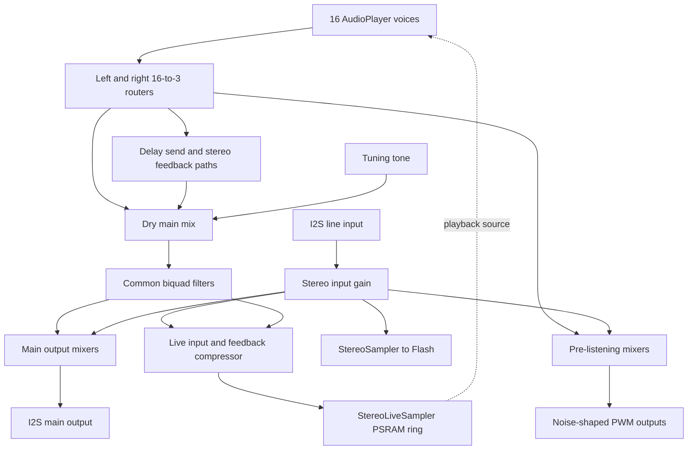

# Firmware Architecture

This document describes the LILLA Audio Sampler firmware architecture and the constraints that matter when maintaining it. It is based on the source accompanying firmware version `7.0.0 04/10/2026`. Constants and source links below are the reference when the implementation changes.

For operating instructions, see the [User Guide](User%20Guide.md). For the project overview and build command, see the [README](README.md).

## 1. Platform and organization

The firmware runs on a Teensy 4.1 at 600 MHz using the Arduino framework and the Teensy Audio processing model. The application combines a foreground `loop()` with interrupt-driven audio updates. Its principal integration point is [src/main.cpp](src/main.cpp): audio objects and connections, hardware initialization, shared application state, page event handling, and storage workflows are assembled there.

[platformio.ini](platformio.ini) defines the `teensy41` build, the pinned Teensy platform/framework/toolchain, GNU C++20, dependencies, and post-build scripts. A separate `teensy41_calibration` environment enables `LILLA_READ_BENCHMARK`; see [read calibration](docs/read-calibration.md) for its use.

| Source area | Responsibility |
| --- | --- |
| `src/main.cpp` | Application composition, startup, foreground control and workflow coordination. |
| `lib/config` | Firmware identification, system capacities, audio timing and playback pitch limits. |
| `lib/Shared*` | Data models, page state, parameter tables and declarations shared between modules. |
| `lib/PlayersManager`, `lib/AudioPlayer` | Voice allocation, playback scheduling, source reads and rendering. |
| `lib/Audio*`, `lib/Router_16x3`, `lib/Stereo*` | Audio processing, routing, effects and recording. |
| `lib/Display*`, `lib/Pointer*` | Page drawing and selection/navigation logic. |
| `lib/ShiftRegisters`, `lib/Encoders`, `lib/Pushbuttons`, `lib/Switches` | Physical control scanning and input interpretation. |
| `lib/ArchivingManager`, `lib/LillaSerialFlash`, `lib/FileNameRegistry` | Persistent metadata, sample storage and imported file names. |
| `include` | Application-level declarations, display definitions and integration headers. |

The separation is practical rather than a strict layered framework: modules use shared state and supplied object pointers/references, and substantial coordination remains in `main.cpp`.

## 2. Execution model and synchronization

### Startup and foreground work

`setup()` suspends audio updates, initializes the controls, reserves 96 audio blocks with `AudioMemory(96)`, calls `Startup_hardware_and_objects()`, handles startup button modes, and reloads persistent state through `Reload_system_state()`. Audio updates are then enabled.

`loop()` services recording errors and background patch-cache loading, scans controls, and handles the current page and operating state. Display drawing and interactive storage workflows belong to this foreground control path. The state enumeration in [SharedElements.h](lib/SharedElements/SharedElements.h) includes the four operating modes as well as Sound Edit, Mixer, Setup, VCF, Delay and MIDI Monitor pages.

### Audio update sequence

Audio blocks contain 128 samples, approximately 2.9 ms at the nominal 44.1 kHz sample rate. The construction order of the `AudioStream` objects in `main.cpp` is significant. In particular:

1. [LillaClock](lib/LillaClock/LillaClock.cpp), instantiated as `Trigger`, resets the cycle timer and advances the cycle counter. While its control callbacks are running, it updates the common filter manager, delay manager and MIDI reader. It also prepares the player read budget.
2. The 16 `AudioPlayer` objects render their voices; the left and right routers collect their output.
3. [CacheCycleFinalizer](lib/CacheCycleFinalizer/CacheCycleFinalizer.cpp) collects diagnostics and player reference masks, then releases retired caches and table banks that no voice still references.
4. The remaining input, recording, effect and output objects process their blocks according to their construction order and connections.

The logical signal-flow diagram below is not an execution-order diagram. Feedback paths also cross audio updates; changing object order can change behavior even when the connections are unchanged.

### Critical sections

In `main.cpp`, `AudioNoInterrupts()` and `AudioInterrupts()` disable and enable the audio software interrupt (`IRQ_SOFTWARE`). They protect short operations that publish related state or change data shared with audio callbacks. They do not represent a general lock against every hardware interrupt.

Stopping `Trigger` pauses its control callbacks while players continue rendering and the audio cycle deadline continues advancing. Stopping `MidiReader` prevents its MIDI processing without stopping the entire audio graph. These operations therefore have different purposes from suspending audio updates.

Keep protected sections short. Display operations, serial reporting and bulk storage transfers must not extend a short state-publication section into a long audio stall. The cache loader demonstrates the intended pattern: reserve work under protection, transfer outside the critical section, then publish completion under protection.

## 3. Audio signal flow

The following diagram summarizes the `AudioConnection` declarations in [main.cpp](src/main.cpp). The delay box includes its mixers and feedback gain stages.

Each player produces left and right output. The paired routers provide three destinations: the delay path, the dry main path, and the pre-listening path. Main playback passes through the common biquad filters before it is combined with the line-input monitoring signal. Pre-listening has its own mixers and noise-shaped PWM outputs.

The input gain stage also feeds peak detection, direct sampling and live sampling. The Live Sampler feedback signal comes from the common filtered playback path. Its feedback control is separate from the delay effect's feedback controls.

Per-voice processing is implemented by [AudioPlayer](lib/AudioPlayer/AudioPlayer.h) together with ADSR, VCF, modulation and table helpers. The graph-level common filter and delay are separate from these per-voice operations.

## 4. Patch, sound and voice model

[config.h](lib/config/config.h) sets 16 players, eight instruments per patch, 200 stored patches and 800 stored sounds. Temporary preview/capture entries extend some runtime arrays beyond those persistent capacities.

| Model | Role |
| --- | --- |
| `Patch_struct` | Groups instrument slots. |
| `Instrument_struct` | References a sound and adds root key, keyboard range, precedence, lock and instrument-filter settings. |
| `Sound_struct` | Holds the sample file identifier, boundaries, playback mode, tuning, pan, MIDI/envelope and gain parameters. |
| `Preset_struct` | Runtime playback configuration, including the resolved audio source. |
| `AudioPlayer` | One allocated playback voice with its own position, release and processing state. |

These structures are defined in [SharedElements.h](lib/SharedElements/SharedElements.h). A sound slot is not a permanently assigned player: notes consume voices from the shared pool. Layered mappings and release tails consequently share the same 16-player capacity.

[PlayersManager](lib/PlayersManager/PlayersManager.h) coordinates voice selection and read-budget preparation. [AudioPlayer](lib/AudioPlayer/AudioPlayer.h) reads Flash, cached PSRAM or live sources and handles playback lifetime. [AudioTables](lib/AudioTables/AudioTables.h), [WavetableManager](lib/WavetableManager/WavetableManager.h) and [NoclickCrossmix](lib/NoclickCrossmix/NoclickCrossmix.h) support wavetable and boundary-smoothing behavior.

### Timing and source limits

[PlaybackProfile.h](lib/config/PlaybackProfile.h) sets final pitch-ratio ceilings of 5 for Flash playback and 35 for PSRAM and wavetable playback. These ceilings include tuning, pitch bend and vibrato; they are not guarantees that every voice can run simultaneously at the maximum ratio.

The read-budget machinery accounts for the cost of source access, and players enforce an audio-cycle deadline. Current configuration uses a 2900 microsecond block budget with a 200 microsecond reserve after player processing. Review [PlayerReadBudget.h](lib/AudioPlayer/PlayerReadBudget.h), [PlayerReadDiagnostics.h](lib/AudioPlayer/PlayerReadDiagnostics.h) and the calibration document before changing read costs or limits. Hardware measurements are needed to establish headroom under worst-case load.

## 5. Memory and persistence

| Memory/storage | Main firmware use | Survives power-off? |
| --- | --- | --- |
| Internal RAM | Runtime objects, voice state, audio blocks and working data. Selected tables and metadata use `DMAMEM` placement in RAM2. | No |
| 32 MiB external PSRAM | Patch audio caches, delay buffers and Live Sampler ring storage, allocated with `EXTMEM`. | No |
| 64 MB external SPI Flash | Imported samples and direct recordings through the custom storage layer. | Yes |
| 128 KiB external FRAM | Patch/sound metadata and persistent configuration managed through the archive layer. | Yes |
| microSD | Audio import/export, MIDI loops and backup/restore files. | Yes |

The PSRAM allocation formulas are centralized in [SharedElements.h](lib/SharedElements/SharedElements.h). They reserve two delay channels of approximately 20 seconds each, a Live Sampler area supporting approximately 20 seconds stereo or 40 seconds mono, and nine patch-cache arrays (`INSTRUMENTS + 1`) from the remaining space, with a small explicit reserve. Buffer sizes include the alignment or extra-block terms specified in those formulas.

Do not allocate new PSRAM buffers on the assumption that the full chip capacity is free. Update the shared layout and review all users of its derived sizes.

### Cache publication and lifetime

[PatchCacheManager](lib/PatchCacheManager/PatchCacheManager.h) tracks cache states `Free`, `Loading`, `Ready` and `Retiring`. A requested file remains backed by Flash until a complete, valid cache is ready.

`P_Service_patch_cache()` in `main.cpp` attempts at most one bounded copy per audio cycle and skips attempts that start too late. It registers SPI usage, transfers outside the audio critical section, then publishes completion and refreshes matching player sources atomically. Loading is withheld when direct sampling owns Flash for recording or conversion.

A patch change does not make the previous buffers immediately reusable. Outgoing voices can still reference them. Retired buffers and table banks are reclaimed only after their reference masks are clear; the loader can request that eligible old readers fade when cache space remains blocked. Preserve this lifetime protocol when changing patch switching or source promotion.

### Stored formats and sample identity

[ArchivingManager](lib/ArchivingManager/ArchivingManager.h) defines dedicated persistent structures, including aligned records and CRC fields. Runtime structures and stored representations must not be treated as interchangeable. Changes to metadata require reviewing serialization, validation, restore behavior and compatibility together.

[LillaSerialFlash](lib/LillaSerialFlash/LillaSerialFlash.h) and [SharedVFS](lib/SharedVFS/SharedVFS.h) provide the sample-storage abstraction. [FileNameRegistry](lib/FileNameRegistry/FileNameRegistry.h) manages imported names; see [file-name registry](docs/file-name-registry.md). Audio IDs, readable file names and backing storage are distinct concerns.

## 6. Recording and capture workflows

### Sampler

[StereoSampler](lib/StereoSampler/StereoSampler.h) receives the amplified line input and writes mono or stereo recording data through the Flash packet/storage layer. The foreground checks its storage-error status even after the user leaves the Sampler page. Conversion into playable RAW material and WAV export are coordinated by the application workflows.

### Live Sampler

[StereoLiveSampler](lib/StereoLiveSampler/StereoLiveSampler.h) records into circular PSRAM storage. Playback can refer to this live source while recording continues. Read/write positioning, wrap behavior and the initial partially filled buffer must remain consistent when changing playback logic.

[AudioLiveCompressor](lib/AudioLiveCompressor/AudioLiveCompressor.h) combines the input and feedback paths using wider intermediate values and linked stereo dynamics. Its implementation uses 128 samples of lookahead and a ceiling of approximately -1 dBFS. It is connected before the live recorder.

[CaptureSources](lib/CaptureSources/CaptureSources.h) represents captured regions with ordinary RAW identifiers while their audio backing is still temporary. Saving a captured patch persists the required audio to Flash. A captured region available for playback in PSRAM is therefore not, by itself, a durable recording.

### Import and export

The project works internally with signed 16-bit PCM at the nominal 44.1 kHz rate. Import and export workflows bridge this representation to microSD files. MP3 decoding and conversion are implemented in [Mp3Import.cpp](src/Mp3Import.cpp); supported formats and conversion details are documented in [MP3 import](docs/mp3-import.md).

## 7. MIDI and loop scheduling

[MidiReader](lib/MidiReader/MidiReader.h) wraps the MIDI library's serial interface and coordinates incoming messages with loop playback. It is updated by `LillaClock` in the audio processing cycle.

[MidiInputBatch](lib/MidiReader/MidiInputBatch.h) bounds incoming work: currently eight ordered messages, up to 64 received bytes and an 80 microsecond parsing limit per batch. Note events preserve order. Pitch bend, channel pressure and modulation use the last value collected for each channel within the batch; other control changes remain ordered. These bounds protect audio processing from bursts of input.

MIDI Loop uses four tracks. [SharedLoop.h](lib/SharedLoop/SharedLoop.h) defines the event records, timing state and current capacity of 100 events per track; both note-on and note-off records consume event capacity. The first track is the master. Timing stretch, track offsets, transposition and gain affect playback through the same player system used by incoming notes. Loop-event processing has a separate per-track budget in `MidiReader`.

Saving a loop stores MIDI events rather than rendered audio. Reproducing a session also requires the relevant patch and sample material.

## 8. User interface

The control path starts with the SPI-connected control expanders and the encoder, pushbutton and switch managers. The foreground interprets those events according to the current page.

`Pointer*` classes represent page selection/navigation behavior; `Display*` classes render page content. `Shared*` modules carry the associated values and state. `main.cpp` connects these pieces to audio and archive operations. When adding a field, review its navigation, drawing, parameter mapping, audio publication and persistence together.

For text popups and red-button confirmation, reuse `Show_popup_text` and `Confirm_frame_on_RED` where applicable. The [User Guide](User%20Guide.md) documents the resulting user-visible behavior.

## 9. Maintenance guide

| Intended change | Starting points and required review |
| --- | --- |
| Add a playback parameter | Shared sound/preset model, `PlayersManager`, `AudioPlayer`, page controls and archive representation. |
| Add an audio stage | Audio object construction order and connections in `main.cpp`, block ownership, CPU cost and audio-pool usage. |
| Change patch switching | Preset publication, outgoing voice lifetime, cache/table reference masks and Flash fallback. |
| Change recording | Recorder update code, Flash ownership or PSRAM boundaries, foreground error handling and save/export paths. |
| Change MIDI behavior | `MidiReader`, batch ordering/coalescing, loop scheduling and per-cycle work bounds. |
| Change persistent data | `ArchivingManager`, FRAM layout, format validation and backup/restore compatibility. |
| Add a page or control | `Shared*`, `Pointer*`, `Display*`, control dispatch in `main.cpp` and the User Guide. |

Follow the repository's [AGENTS.md](AGENTS.md) conventions when editing: CRLF text files, single-line code expressions, explicit braces for conditional blocks, and matching header/source ownership for new declarations and definitions. Keep audio critical sections visually distinct. Avoid redundant range checks in hot paths where the caller contract already guarantees valid values; validate external data at its input boundary.

For firmware changes, build with `pio run -e teensy41` and exercise the affected workflow on hardware. Changes to audio reads or scheduling also need stress checks with layered notes, release tails, patch switching, MIDI bursts and the relevant recording/effect paths. A successful build alone does not establish real-time headroom or persistence compatibility.

This document describes source-level behavior. Timing margins and hardware performance require measurement; keep this description and its source references current when those mechanisms change.
