<a id="lilla-user-guide"></a>

# Lilla Guide utilisateur

[English](User%20Guide.md) | [Italiano](Manuale%20Utente.md) | [Deutsch](Benutzerhandbuch.md) | [Français](Guide%20utilisateur.md)

Pour **LILLA Audio Sampler 2026 | PCB2026_R1 | micrologiciel 7.0.2**

Édition du guide : **8 octobre 2026**

Édition imprimable en anglais : [User Guide au format PDF](User%20Guide.pdf).

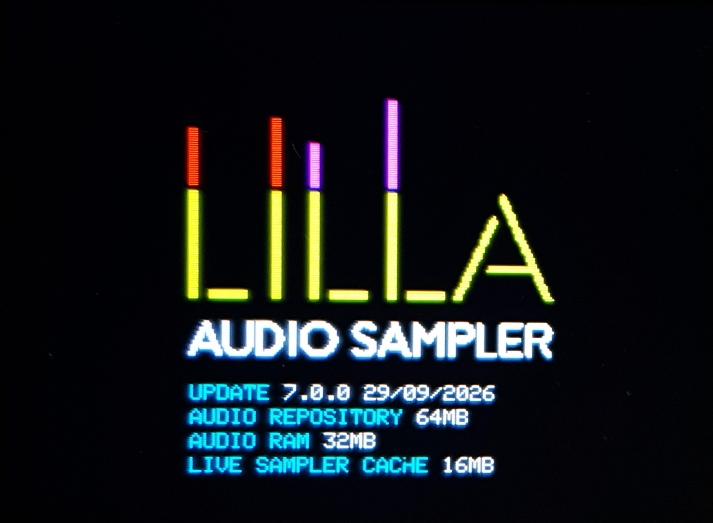

*Écran d'accueil. Les photographies montrent un instrument fonctionnel ; les numéros de patch, noms de fichiers et valeurs sont des exemples.*

LILLA rassemble la lecture d'échantillons, l'enregistrement d'entrée ligne, l'échantillonnage en direct et le bouclage MIDI dans un seul instrument. Ce guide vous emmène depuis votre premier patch jouable jusqu'à la création de vos propres sons et la préservation d'une session complète.

Commencez par **Premiers pas** pour jouer immédiatement. Lisez **Fichiers, sons et patches** avant de créer une bibliothèque : comprendre ce que conserve chaque opération d'enregistrement facilite l'utilisation de l'instrument.

**Comment lire ce guide :** les noms en gras tels que **Select** font référence à des commandes physiques ; Le texte `UPPERCASE` fait référence à des étiquettes d’écran ou à des messages. **Tools > Setup** signifie régler le sélecteur Tools sur Setup, puis appuyer sur Tools. Une procédure numérotée décrit l'ordre des opérations. Des photographies illustrent la mise en page ; les instructions qui l'accompagnent décrivent le micrologiciel du référentiel, y compris les modifications apportées après la prise d'une photographie.

Les procédures ont été examinées par rapport au micrologiciel et aux photographies d'affichage fournies. Une revue complète de l’instrument physique reste à réaliser.

<a id="contents"></a>

## Sommaire

- [Premiers pas](#getting-started)
- [Connexions et boutons](#io-connections-and-buttons)
- [Commandes et navigation](#controls-and-navigation)
- [Fichiers, sons et patches](#files-sounds-and-patches)
- [Performance](#performance)
- [Modifier un son](#editing-a-sound)
- [Importer de l'audio](#importing-audio)
- [Enregistrer avec Sampler](#recording-with-sampler)
- [Live Sampler](#live-sampler)
- [MIDI Loop](#midi-loop)
- [Mixer, Delay et filtres](#mixer-delay-and-filters)
- [Setup et commandes MIDI](#setup-and-midi-controls)
- [Sauvegarde et restauration](#backup-and-restore)
- [Mettre à jour le firmware sous Windows](#updating-the-firmware-on-windows)
- [Mettre à jour le firmware sur Mac](#updating-the-firmware-on-mac)
- [Dépannage](#troubleshooting)
- [Projets pratiques](#practical-projects)
- [Aide-mémoire](#quick-reference)
- [Glossaire](#glossary)

**Flux de travail populaires :** [Créer une division du clavier](#build-a-keyboard-split) | [Accorder un son et utiliser Auto Tune](#tune-a-sound-and-use-auto-tune) | [Capturer une boucle en direct dans un patch](#capture-a-live-loop-into-a-patch) | [Prévoir une archive complète](#plan-a-complete-archive)

<a id="getting-started"></a>

## Premiers pas

LILLA est un échantillonneur matériel polyphonique et multitimbral avec jusqu'à 16 voix de lecture. Un patch de performance peut contenir jusqu'à huit sons, avec des canaux MIDI et des plages de clavier individuels. Vous pouvez lire de l'audio importé, enregistrer l'entrée ligne, travailler avec un tampon en direct temporaire et enregistrer des boucles MIDI à quatre pistes.

<a id="choose-the-right-mode"></a>

### Choisir le mode adapté

| Tu veux... | Choisir | Avec quoi vous travaillez |
| --- | --- | --- |
| Jouez sur un clavier partagé, un instrument superposé ou une configuration multitimbrale | **Performance** | Un patch avec jusqu'à huit emplacements sonores. |
| Enregistrez une prise, conservez-la dans la mémoire d'enregistrement ou exportez un WAV | **Sampler** | Un enregistrement audio mono ou stéréo en Flash. |
| Explorez l'audio entrant et capturez un fragment sélectionné | **Live Sampler** | Un tampon audio circulaire temporaire. |
| Enregistrez et rejouez les phrases jouées sur votre contrôleur MIDI | **MIDI Loop** | Quatre pistes d'événements MIDI utilisant le patch actuel. |

Utilisez Sampler pour une prise que vous avez l'intention d'écouter, de convertir ou d'exporter. Utilisez Live Sampler lorsque le son intéressant est quelque chose que vous souhaitez trouver dans un flux audio continu.

<a id="connect-and-play"></a>

### Brancher et jouer

1. Connectez un contrôleur MIDI à l'entrée MIDI de LILLA.
2. Connectez la sortie ligne stéréo à votre table de mixage, amplificateur ou interface audio. Commencez par de faibles niveaux d’écoute.
3. Allumez LILLA et attendez la fin du démarrage.
4. Réglez le sélecteur Modes sur **Performance**.
5. Tournez **Select** pour mettre en surbrillance le numéro du patch, puis tournez **Value** pour choisir un patch existant.
6. Réglez votre contrôleur sur le canal MIDI affiché pour un son dans le patch.
7. Jouez des notes dans la plage `FROM K` et `TO K` de ce son.
8. Augmentez progressivement **Line Out Vol**.

**Ce que vous devriez voir :** la page Performance affiche un numéro de patch et ses lignes de sons actives. Le canal MIDI et la plage du clavier sur chaque rangée déterminent quelles notes peuvent déclencher ce son. Un patch à huit emplacements ne doit pas nécessairement utiliser chaque emplacement.

**Ce que vous devriez entendre :** un son lorsque vous jouez une note dans la plage d'une ligne active sur le canal MIDI qui lui est attribué. Si vous n'entendez rien, commencez par le canal et la plage avant de changer l'échantillon ou son enveloppe.

<a id="your-first-edit"></a>

### Votre première modification

1. Appuyez sur **S1** si le son 1 est actif, ou appuyez sur le bouton d'un autre son actif.
2. Tournez Select pour mettre en surbrillance `GAIN`, puis tournez légèrement Value.
3. Jouez quelques notes et écoutez le changement.
4. Sélectionnez `RETURN` et appuyez sur Select.
5. Dans Performance, choisissez `SAVE` lorsqu'il est disponible.

Ceci introduit le cycle d'édition normal : **ouvrir un son → l'ajuster → revenir à Performance → enregistrer le patch**. Le retour d'une page conserve vos modifications de travail, mais ne remplace pas l'étape Enregistrer.

<a id="finish-a-session"></a>

### Terminer une session

Avant de l'éteindre, enregistrez les patchs édités, enregistrez toute boucle MIDI que vous souhaitez conserver et terminez toutes les sauvegardes de capture Live Sampler en attente. Attendez la fin des opérations d'écriture ou d'exportation. Le tampon actif lui-même ne survit pas à la mise hors tension.

Si aucun audio approprié n’est chargé, suivez [Importer de l'audio](#importing-audio). L'importation remplace la bibliothèque audio Flash et supprime les enregistrements existants, alors sauvegardez d'abord votre travail.

<a id="io-connections-and-buttons"></a>

## Connexions et boutons

| Connexion ou bouton | Connecteur | Description |
| --- | --- | --- |
| Line in | Prise 3,5 mm | Entrée ligne stéréo/entrée microphone dynamique stéréo. |
| Line out | Prise 3,5 mm | Sortie ligne stéréo, 3,1 Vpp. |
| Phones line | Prise 3,5 mm | Sortie casque principale. |
| Phones pre-listen | Prise 3,5 mm | Sortie casque de pré-écoute. |
| MIDI IN | Prise 3,5 mm | Entrée MIDI. |
| MIDI OUT | Prise 3,5 mm | Sortie MIDI. |
| Portail IN | Prise 3,5 mm | Entrée de porte, +5 V. |
| Portail OUT | Prise 3,5 mm | Sortie de porte, +5 V. |
| USB-C | USB-C | Alimentation et programmation +5 V DC. |
| Bouton Firmware_upload mode | Bouton | Entrez en mode de téléchargement du micrologiciel. |
| Bouton On/off | Bouton | Allumer ou éteindre l'instrument. |

**Développement futur :** MIDI OUT, Gate IN et Gate OUT sont physiquement disponibles et accessibles via des classes déjà incluses dans la base de code du micrologiciel. Aucune fonctionnalité destinée aux utilisateurs n'utilise actuellement ces connexions ; ils sont disponibles pour un développement futur.

<a id="controls-and-navigation"></a>

## Commandes et navigation

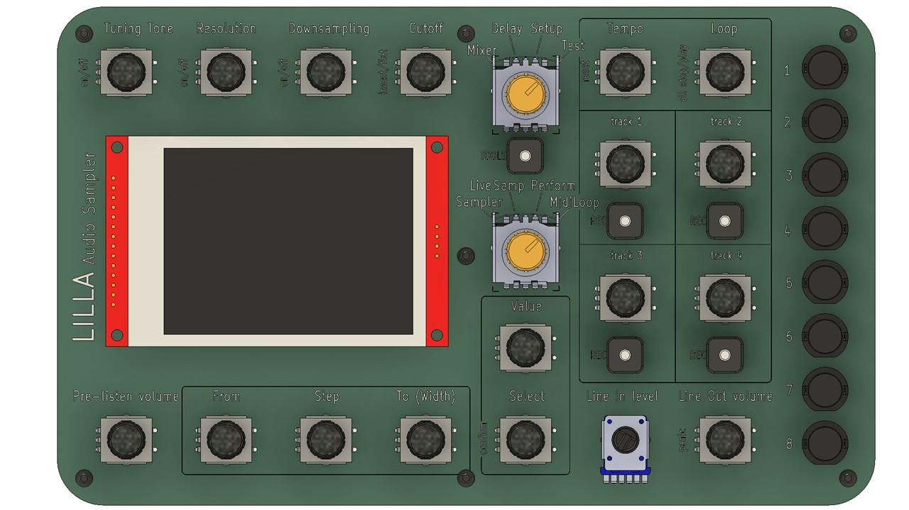

*Aperçu du panneau supérieur : commandes physiques et leurs positions.*

Le cadre de sélection blanc identifie le champ ou la commande qui répondra aux commandes de navigation. Dans les photographies fournies, les étiquettes sont généralement en cyan, les valeurs et commandes modifiables en jaune et les en-têtes de page en rouge.

**Tourner et appuyer sur un encodeur sont des actions distinctes.** Par exemple, tourner Value modifie un paramètre en surbrillance, tandis qu'appuyer sur Value peut réinitialiser ou basculer ce paramètre sur des pages particulières.

Les mêmes contrôles effectuent des tâches différentes selon la page active. Suivez le champ en surbrillance et les options actuellement visibles à l'écran.

| Contrôle | Utilisation principale |
| --- | --- |
| Sélecteur Modes | Choisissez Sampler, Live Sampler, Performance ou MIDI Loop. |
| Sélecteur Tools | Choisissez Mixer, Delay, Setup ou Test. |
| Bouton Tools | Ouvrez l'outil sélectionné ; le Tools LED indique l'accès à l'outil. |
| Sélectionnez, tournez | Déplacez la surbrillance entre les champs et les éléments de menu. |
| Sélectionnez, appuyez sur | Exécutez une commande de menu, confirmez un choix ou entrez/quittez un groupe de champs. |
| Value, tournez | Modifiez le paramètre en surbrillance. |
| S1-S8 | Ouvrez les sons actifs dans Performance ; S1 ouvre un enregistrement mono ou canal gauche et S2 ouvre le canal droit dans Sampler ; capturez dans les emplacements sonores dans Live Sampler. |
| From / To | Ajustez les limites de l'échantillon dans Sound Edit ; ajustez la région de lecture en direct dans Live Sampler. |
| Step | Modifier les incréments d'édition ; sa fonction push dépend de la page. |
| Line Out Vol | Ajustez le volume de lecture du patch sur les pages liées aux performances. |
| Pre Listen Vol | Ajustez le niveau de pré-écoute. |
| Resolution / Downsampling | Modifiez le caractère de lecture grâce à la réduction de bits et à la répétition d'échantillons. |
| Cutoff | Ajustez le filtre passe-bas commun ; appuyez pour le ramener à sa coupure maximale. |
| Tuning Tone | Activez la référence de réglage ; tournez-le pour régler son niveau lorsqu’il est activé. |
| Boucle / Tempo | Sélectionnez et contrôlez les boucles MIDI et leur timing de lecture. |
| Track 1-4 / Rec 1-4 | Contrôlez les pistes individuelles du MIDI-loop et leur enregistrement. |

Pour ouvrir un outil, placez le sélecteur Tools sur la position requise et appuyez sur **Tools**. Test ouvre le moniteur MIDI. Utilisez le bouton Tools pour revenir d'un outil pris en charge, ou sélectionnez le mode de fonctionnement requis.

Dans les boîtes de dialogue de confirmation, tournez **Select** pour choisir une option et appuyez dessus pour confirmer. Lisez la boîte de dialogue avant de confirmer : enregistrer, supprimer, effacer et restaurer ont des conséquences différentes.

Les menus sont dynamiques. Une commande peut être masquée lorsque l'état actuel ne le permet pas, par exemple lorsqu'il n'y a aucun enregistrement à exporter. Un patch enregistré et non modifié peut afficher moins de commandes qu'un patch avec des modifications en attente.

<a id="three-navigation-patterns"></a>

### Trois méthodes de navigation

**Commandes de menu :** tournez Select jusqu'à ce que le cadre entoure la commande, puis appuyez sur Select. Si une confirmation apparaît, sélectionnez la réponse souhaitée et appuyez à nouveau sur Select.

**Modification des paramètres :** tournez Select jusqu'à ce que le paramètre soit mis en surbrillance, puis tournez Value. Écoutez pendant que vous vous ajustez ; de nombreux changements sont immédiatement audibles.

**Tableaux de sons ou de sources :** sélectionnez d'abord la ligne ou la source, puis appuyez sur Select pour saisir ses champs modifiables. Appuyez à nouveau sur Select pour quitter ce groupe dans lequel la page prend en charge ce modèle.

<a id="useful-shortcuts"></a>

### Raccourcis utiles

| Où | Action | Résultat |
| --- | --- | --- |
| Performance | Appuyez sur un bouton S1-S8 actif | Ouvrez l'éditeur de ce son. |
| Sound Edit de Performance | Appuyez à nouveau sur le même bouton son | Ouvrez sa page VCF. |
| Sound Edit de Sampler | Appuyez sur S1 ou S2 pour la stéréo. | Sélectionnez le canal d'enregistrement ; le même bouton conserve ce canal dans Sound Edit. |
| Sound Edit, `PITCH` sélectionné | Appuyez sur Value | Réinitialisez le réglage de la hauteur. |
| Sound Edit, `PITCH` sélectionné | Appuyez sur Select | Exécutez Auto Tune sur la région audio sélectionnée. |
| Sound Edit | Appuyez sur From | Déplacez le début de la région au début de la source. |
| Sound Edit | Appuyez sur To | Activez/désactivez le comportement d'édition des limites/tranches. |
| Sound Edit | Appuyez sur Step | Sélectionnez l’étape de découpage relative à la région. |
| Performance ou Sound Edit, `PAN` sélectionné | Appuyez sur Value | Centrez la poêle. |
| Live Sampler | Appuyez sur Step | Activez/désactivez le comportement de verrouillage du point de départ. |
| Commandes de lecture communes | Appuyez sur Cutoff | Restaurer la coupure passe-bas commune maximale. |
| Commandes de lecture communes | Appuyez sur Line Out Vol | Arrêtez les joueurs actifs ; efface également le retour de retard en dehors du contexte de retard Direct Sampler. |

Utilisez le dernier raccourci lorsque vous devez arrêter rapidement d'émettre des notes. Dans MIDI Loop, il arrête également la lecture de la piste.

<a id="files-sounds-and-patches"></a>

## Fichiers, sons et patches

| Terme | Signification |
| --- | --- |
| Fichier audio | L’échantillon source utilisé pour la lecture. L'audio importé est converti en audio mono RAW dans Flash. |
| Enregistrement | Audio enregistré par le Sampler dans sa zone d'enregistrement Flash ; il peut être mono ou stéréo. |
| Son | Un fichier source ainsi que des paramètres de lecture tels que le découpage, la hauteur, l'enveloppe, le panoramique et le gain. |
| Emplacement instrument / son | Une des huit positions maximum dans un patch, avec mappage MIDI, note de référence, plage de clavier et paramètres de filtre. |
| patch | Le groupe de sons et de paramètres utilisés pour une performance. |
| Boucle MIDI | Événements MIDI enregistrés, organisés en quatre pistes. Il ne contient pas les échantillons audio joués par ces événements. |
| Tampon en direct | Audio temporaire conservé dans PSRAM pour Live Sampler. |

Le firmware permet de stocker jusqu'à 200 patchs et 800 enregistrements sonores. Ce sont des capacités de stockage ; l'instrument dispose de jusqu'à 16 voix de lecture simultanée. La polyphonie disponible dépend également de la charge de travail de lecture.

Flash contient la bibliothèque audio importée et les enregistrements Sampler. PSRAM contient de l'audio en direct. La carte microSD est utilisée pour l'importation, l'exportation WAV, les sauvegardes et les fichiers MIDI-loop.

<a id="follow-the-sound-from-source-to-keyboard"></a>

### De la source audio au clavier

Une configuration typique comporte trois couches :

**Fichier audio → Paramètres sonores → Instrument dans un patch**

Par exemple, `piano.wav` est importé sous le nom `piano.raw`. Un son sélectionne cette source et définit son trim, son enveloppe et son réglage. Un emplacement d'instrument lui attribue une note de référence, un canal MIDI et une plage de clavier jouable.

La modification du trim ajuste la partie de la source qui est lue. Il ne coupe pas le fichier source d'origine. Supprimer un instrument supprime sa place dans le patch ; cela n’efface pas l’audio source.

Une étiquette à l'écran telle que `SOUND 1` signifie le premier emplacement du patch actuel. Ce n'est pas la même chose que le fichier audio 1, l'enregistrement 1 ou le patch 1.

<a id="what-survives-power-off"></a>

### Que reste-t-il après l'extinction ?

| Matériel | Comment le garder |
| --- | --- |
| Modifications d'un patch et de ses sons | Enregistrer depuis Performance. |
| Un enregistrement Sampler terminé | Terminez l'enregistrement avec `STOP` ; utilisez la sauvegarde ou l'exportation WAV pour une copie externe. |
| Sampler enregistrant les limites du A/B | Enregistré automatiquement lors de l'édition ; rappelé avec l'enregistrement pour la lecture au clavier et l'exportation RAW/WAV. Les autres modifications de lecture d'enregistrement restent dans la session en cours. |
| Un enregistrement Sampler converti avec `MAKE_RAW` | Conservez la source Flash générée et enregistrez le patch qui l'utilise. |
| Audio toujours dans le tampon Live Sampler | Capturez la région souhaitée dans un emplacement sonore et enregistrez le patch obtenu. |
| Un son Live Sampler nouvellement capturé | Enregistrez son patch afin que l'audio en attente soit écrit dans Flash. |
| Une boucle MIDI | Enregistrez-le sur microSD à partir de MIDI Loop. |
| Une copie portable de votre travail | Conservez la configuration, l'enregistrement audio, la bibliothèque source et les fichiers MIDI-loop comme décrit dans Sauvegarde et restauration. |

<a id="patch-numbers-and-the-temporary-session"></a>

### Numéros de patch et espace de travail temporaire

Les patches normaux utilisent les **ID 0 à 199**. **Patch 200** est l'espace de travail d'échantillonnage temporaire ; ce n'est pas un emplacement de patch normal supplémentaire.

La première capture sonore réussie du Live Sampler crée un patch normal en utilisant le **premier ID disponible en 0-199**. Les captures ultérieures peuvent remplir ses emplacements restants. Accédez à Performance pour examiner et enregistrer ce patch.

<a id="file-names-matter"></a>

### L'importance des noms de fichiers

L'en-tête Sound affiche uniquement les huit premiers caractères du nom de base source et omet `.raw`. Deux fichiers portant des noms similaires peuvent donc se ressembler dans ce petit champ. Choisissez des débuts courts et distinctifs tels que `BassDry` et `BassFX`.

LILLA conserve l'identité d'un fichier lorsque l'audio est manquant. Réimporter le même nom de base peut reconnecter les sons qui y font référence. Renommer un fichier crée une identité différente ; traitez les noms de bibliothèques comme faisant partie de votre projet.

La table des noms de fichiers prend en charge 260 identités RAW, y compris la source de secours, les fichiers générés et les références conservées aux fichiers manquants. La mémoire audio libre et les identités de fichiers disponibles sont des ressources distinctes.

<a id="performance"></a>

## Performance

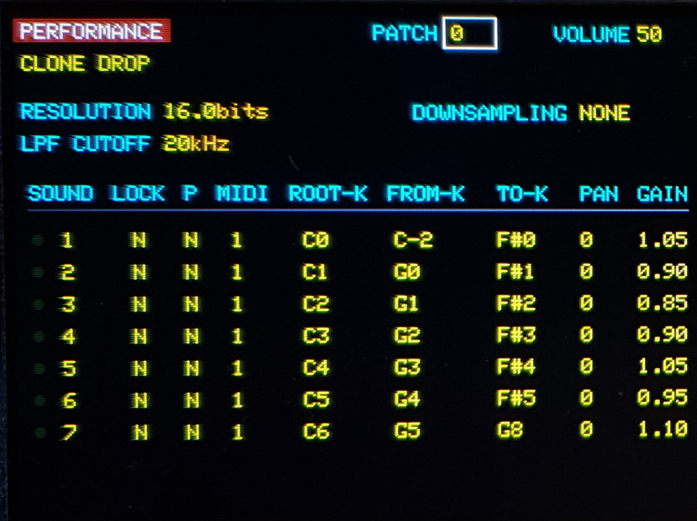

*Un exemple de patch réparti sur sept emplacements sonores. Chaque ligne a sa propre note de référence, sa propre plage et son propre gain.*

Performance est la page principale pour assembler et sauvegarder un instrument jouable. Lisez-le de haut en bas : le patch et le volume en haut, les commandes communes de caractères sonores au milieu, puis les rangées d'instruments actifs.

<a id="choose-a-patch"></a>

### Choisir un patch

Mettez en surbrillance le numéro du patch avec **Select** et tournez **Value** pour parcourir les patchs existants.

Lorsque le patch actuel comporte des modifications, LILLA demande quoi faire avant de changer. Vous pouvez rester dans le patch actuel, ignorer ses modifications ou les enregistrer et continuer. Utilisez les choix affichés plutôt que de vous éloigner sans vérifier l'invite.

<a id="map-sounds-to-your-controller"></a>

### Associer les sons au contrôleur

1. Mettez en surbrillance une ligne sonore.
2. Appuyez sur **Select** pour saisir ses champs.
3. Tournez **Select** pour vous déplacer entre les champs.
4. Tournez **Value** pour modifier le champ sélectionné.
5. Appuyez sur **Select** pour quitter les champs de la ligne.

| Champ | But |
| --- | --- |
| `SOUND` | Emplacement sonore dans le patch, numéroté de 1 à 8. |
| `LOCK` | Protège le son contre certaines commandes de performance, notamment le pitch bend, Resolution et Downsampling. Influe également sur la gestion du relâchement des notes. |
| `P` | Priorité de lecture : donne la priorité au son dans l'attribution des voix. Cela ne garantit pas des voix illimitées. |
| `MIDI` | Réception du canal MIDI, affiché sous la forme 1-16. |
| `ROOT K` | Clé de référence utilisée pour le mappage de hauteur du son. |
| `FROM K` / `TO K` | Gamme de clavier incluse qui déclenche ce son. |
| `PAN` | Position stéréo ; appuyez sur Value sur ce champ pour le centrer. |
| `GAIN` | Niveau sonore. |

Pour un partage de clavier, placez deux sons sur le même canal MIDI avec des plages de touches distinctes. Pour un calque, attribuez-leur des plages qui se chevauchent. Pour la lecture multitimbrale, attribuez différents canaux MIDI.

<a id="build-a-keyboard-split"></a>

### Créer une division du clavier

Un split permet à une partie du clavier de jouer un son de basse et à une autre de jouer un pad, un piano ou un lead.

1. Commencez avec un patch contenant deux sons actifs. Si nécessaire, ouvrez un son existant et utilisez `CLONE` pour ajouter un emplacement.
2. Choisissez la source et l'enveloppe appropriées pour chaque son.
3. Dans Performance, attribuez aux deux emplacements le même canal MIDI.
4. Réglez le `TO K` du Sound 1 sur la dernière touche de la zone inférieure.
5. Réglez le `FROM K` de Sound 2 sur la touche suivante au-dessus.
6. Test les deux notes de chaque côté du point de partage.
7. Équilibrez les gains et enregistrez le patch.

Les gammes sont inclusives. Si le son 1 se termine sur la même touche que celle où commence le son 2, cette touche déclenche les deux sons.

<a id="build-a-layer-or-multitimbral-setup"></a>

### Créer une superposition ou une configuration multitimbrale

Pour une **couche**, attribuez le même canal MIDI et les mêmes plages qui se chevauchent à deux emplacements ou plus. Commencez avec des gains individuels plus faibles, puis augmentez-les tout en écoutant le son combiné.

Pour une **configuration multitimbrale**, attribuez différents canaux à différents emplacements. Un séquenceur ou un contrôleur peut alors adresser chaque partie séparément. Un canal MIDI sélectionne quel instrument répond ; le numéro d'emplacement n'établit pas automatiquement ce canal.

Chaque couche déclenchée utilise des voix de lecture. Un accord de quatre notes avec deux couches peut nécessiter huit voix avant que les queues de relâchement soient comptées.

<a id="set-the-root-key"></a>

### Définir la note de référence

La note de référence sert de repère au clavier pour l'échantillon. À cette note, l'échantillon est lu avec son propre réglage de hauteur ; les notes supérieures et inférieures transposent la source par rapport à cette référence.

Pour un échantillon à hauteur définie, choisissez comme référence la note représentée par l'enregistrement. Pour un son déclenché par une seule touche, réglez `FROM K` et `TO K` sur la même note et choisissez une note de référence adaptée à la hauteur de lecture souhaitée.

Les étiquettes d'octave dépendent du `FIRST OCTAVE` du Setup. Lorsque vous comparez les paramètres avec un autre appareil, comparez la touche MIDI réelle ainsi que son nom d'octave affiché.

<a id="save-or-duplicate-a-patch"></a>

### Enregistrer ou dupliquer un patch

Utilisez les commandes affichées dans le menu Performance :

- `SAVE` : stocke le patch actuel et les sons édités.
- `CLONE` : créez une copie dans un autre emplacement de patch disponible.
- `SAVE_AS_NEW` : stocke le résultat modifié en tant que nouveau patch.
- `EXIT` : ignorez les modifications en cours via le workflow de sortie Performance.
- `DROP` : supprimez le patch, après la confirmation de la suppression.

La commande `RETURN` d'un son conserve les modifications dans la session en cours. Enregistrez le patch pour rendre ces modifications persistantes.

Utilisez `CLONE` lorsque vous souhaitez développer un deuxième patch à partir d'un patch existant. Utilisez `SAVE_AS_NEW` lorsque vous avez modifié un patch et souhaitez conserver le résultat sous un autre patch disponible ID. Lisez la destination affichée et la confirmation avant de continuer.

**Avant de passer à un flux de travail d'échantillonnage, enregistrez le patch que vous étiez en train d'éditer.** Live Sampler peut conserver le patch Performance précédent en mémoire, mais la création d'un nouveau patch capturé nécessite que ce patch précédent n'ait aucune modification en attente.

<a id="editing-a-sound"></a>

## Modifier un son

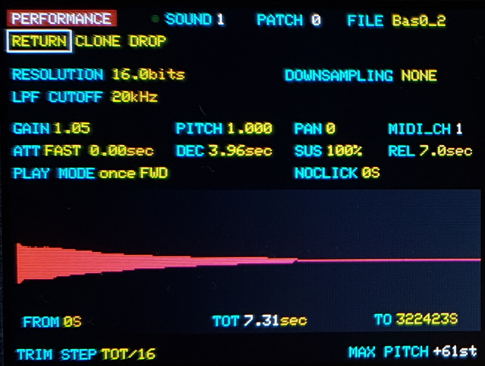

*La forme d'onde appartient à la source sélectionnée. `FROM`, `TO` et `TOT` décrivent la région jouable ; `TRIM STEP` contrôle l'incrément d'édition.*

À partir de Performance, appuyez sur **S1-S8** pour qu'un son actif ouvre Sound Edit. Un emplacement inutilisé affiche `SOUND ... IS NOT USED` ; appuyer dessus ne crée pas de nouveau son.

<a id="choose-and-trim-the-source"></a>

### Choisir et découper la source

1. Mettez en surbrillance le champ du fichier avec **Select**.
2. Tournez **Value** pour choisir une source disponible.
3. Jouez le son de votre contrôleur MIDI.
4. Tournez **From** et **To** pour régler la région de lecture.
5. Tournez **Step** pour sélectionner un incrément de découpage approprié : utilisez des étapes plus grandes pour trouver la région, puis des étapes plus petites pour l'affiner.

La modification du fichier source réinitialise la région de découpage sur toute la longueur du nouveau fichier et réinitialise son réglage de hauteur. Revérifiez les limites après avoir modifié les fichiers.

<a id="work-from-a-rough-cut-to-a-precise-region"></a>

### Passer d'une découpe grossière à une région précise

Commencez par une grande étape de découpage pour supprimer de longs silences ou localiser une phrase. Réduisez le pas à proximité de l’attaque et du point final souhaités. Jouez l'échantillon à plusieurs reprises au fur et à mesure que vous l'affinez : la forme d'onde aide à localiser un événement, mais l'écoute vous indique si vous avez supprimé son attaque ou laissé une queue indésirable.

Appuyer sur **From** ramène le début au début de la source. Appuyer sur **To** permet de basculer entre la modification d'un point de terminaison et l'utilisation d'une tranche. Dans le comportement de tranche, le déplacement de From peut déplacer la région tout en conservant sa longueur ; regardez l'affichage de la région lorsque vous la déplacez.

Une région courte est utile pour une texture répétitive. Une région plus longue peut préserver l’attaque et la dégradation naturelles d’un instrument. Si vous modifiez la source par la suite, répétez le processus de découpage car le changement de source réinitialise ses limites.

<a id="shape-playback"></a>

### Façonner la lecture

Utilisez Select pour mettre en surbrillance un paramètre et Value pour le modifier :

| Paramètre | But |
| --- | --- |
| Pitch | Accorder l'échantillon. |
| Gain / Pan | Réglez le niveau et la position stéréo. |
| Attack | Définissez la rapidité avec laquelle le son atteint son niveau initial. |
| Decay | Réglez la transition au niveau de sustain. |
| Sustain | Réglez le niveau de l’enveloppe conservée. |
| Release | Réglez le fondu après la sortie. |
| Play mode | Choisissez le sens de lecture et le comportement en one-shot ou en boucle. |
| Noclick | Ajustez le lissage des limites de boucle si disponible. |

| Mode de lecture | Comment la région est lue | Utilisation typique |
| --- | --- | --- |
| Once FWD | Du début à la fin une fois. | Hits, paroles et désintégrations naturelles. |
| Once REV | De la fin au début une fois. | Inversez les impacts et les gonflements. |
| Loop FWD | Se répète dans le sens avant. | Tonalités soutenues et phrases répétitives. |
| Loop FWD/REV | Alterne la direction, en commençant vers l'avant. | Des textures qui se retournent aux frontières. |
| Loop REV/FWD | Alterne la direction, en commençant en sens inverse. | Variation à démarrage inversé d'une boucle alternée. |
| Loop REV | Se répète dans le sens inverse. | Textures répétitives inversées. |

Le comportement de l’enveloppe et du déclenchement des notes affecte toujours ce que vous entendez. Une région en boucle peut disparaître avec l’enveloppe ; une source unique a toujours une fin finie.

**Un point de départ simple pour l'enveloppe :** utilisez une attaque courte pour les percussions, une attaque plus lente pour un pad et un relâchement suffisamment long pour éviter une fin brusque. Avec une boucle, augmentez le sustain pour entendre clairement la région répétée avant de façonner le déclin et le relâchement.

Pour une boucle propre, affinez ses points de début et de fin avant d'augmenter Noclick. La gamme Noclick disponible dépend de la région sélectionnée.

<a id="tune-a-sound-and-use-auto-tune"></a>

### Accorder un son et utiliser Auto Tune

La valeur `PITCH` indique le rapport de lecture : **1.000** correspond à la vitesse d'origine de la source. Augmenter la hauteur accélère également la lecture normale de l'échantillon ; la diminuer ralentit la lecture.

1. Sélectionnez `PITCH`.
2. Tournez **Value** pour régler à l'oreille ou appuyez sur **Value** pour réinitialiser le réglage.
3. Appuyez sur **Select** pour exécuter **Auto Tune** sur la région choisie.
4. Écoutez le résultat à la tonalité fondamentale et comparez-le avec vos autres instruments.
5. Enregistrez le patch si vous souhaitez conserver l'ajustement.

Auto Tune est disponible en lecture unique et en boucle. Il analyse la composante fréquentielle la plus forte et la rapproche de la note chromatique la plus proche. Une harmonique dominante, une attaque bruitée ou un échantillon sans hauteur définie peuvent ne pas correspondre à la fondamentale musicale attendue. Pour un résultat plus clair, choisissez une portion stable à hauteur définie et vérifiez le résultat à l'oreille.

Si une erreur `AUTO-TUNE` apparaît, lisez sa raison : une région non valide, une source indisponible, aucun signal mesurable ou une opération audio occupée nécessite une réponse différente. Auto Tune ne remplace pas le choix de la note de référence et de la plage de clavier correctes.

L'écran `MAX PITCH` décrit le plafond de lecture disponible pour le chemin source actuel. Cela peut changer avec la mise en cache des sources et la préparation de la lecture ; ne présumez pas que chaque source a le même plafond de transposition.

<a id="return-clone-or-remove-a-sound"></a>

### Revenir, cloner ou retirer un son

Les commandes suivantes s'appliquent aux sons ouverts à partir de Performance. Pour un enregistrement ouvert depuis Sampler, la seule commande de menu est `RETURN` ; voir [Modifier un enregistrement avant conversion ou exportation](#edit-a-recording-before-conversion-or-export).

- `RETURN` conserve les modifications et revient à la page de performances précédente.
- `CLONE` copie l'instrument dans un emplacement libre du patch actuel. Ajustez la plage de tonalités, la note de référence ou la source de la copie selon vos besoins.
- `DROP` supprime l'instrument du patch actuel.

Enregistrez le patch après avoir terminé. La suppression d'un emplacement audio est différente de la suppression de son fichier audio source.

<a id="importing-audio"></a>

## Importer de l'audio

> **L'importation remplace la bibliothèque audio.** La confirmation de l'importation efface les fichiers audio Flash et les enregistrements Sampler précédents. Créez une sauvegarde et conservez votre source audio sur votre ordinateur avant de continuer.

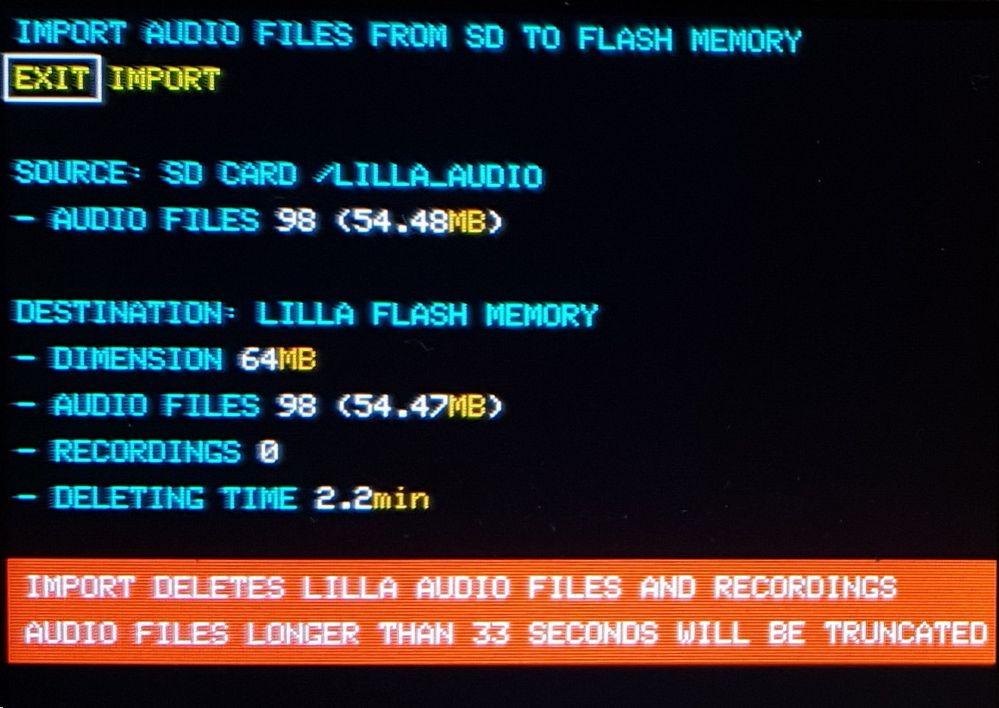

*Vérifiez à la fois le rapport source et la capacité de destination avant l'importation. Cette photographie dit 35 secondes ; la limite actuelle du micrologiciel est de 3 Mio de PCM mono décodé, soit environ 35,7 secondes.*

<a id="prepare-the-microsd-card"></a>

### Préparer la carte microSD

Créez `/LILLA_AUDIO` à la racine de la carte et placez vos fichiers audio directement à l'intérieur.

| Format | Exigences d'importation |
| --- | --- |
| `.raw` | Mono sans tête, signé petit-boutiste 16 bits PCM à 44,1 kHz. |
| `.wav` | PCM non compressé, 16 bits, 44,1 kHz, mono ou stéréo. |
| `.aif` / `.aiff` | AIFF non compressé, 16 bits, 44,1 kHz, mono ou stéréo. |
| `.mp3` | Mono ou stéréo aux taux standard MP3 de 8 à 48 kHz ; converti en 44,1 kHz. |

Les canaux d'un fichier stéréo importé sont moyennés pour produire une source mono. Pour conserver la stéréo sous forme de deux fichiers jouables séparément, préparez avant l'importation des fichiers gauche et droit distincts, avec des noms différents.

L'audio importé est stocké sous le nom `<basename>.raw`. Utilisez des noms de base distincts : `piano.wav` et `piano.mp3` ciblent tous deux `piano.raw` et sont traités comme des doublons.

Une disposition de carte simple est :

```text
Racine microSD/
  LILLA_AUDIO/
    BassDry.wav
    Bell.aiff
    DrumLoop.mp3
    Texture.raw
```

Mettez les fichiers directement dans ce dossier. Gardez leurs noms de base distincts et ne dépassant pas 31 octets. Les noms ASCII simples sont un moyen simple de rester dans cette limite. Évitez les noms réservés à l'enregistrement des données, tels que `P12.raw`.

Un MP3 compressé peut être petit sur votre ordinateur mais beaucoup plus volumineux après la conversion. Jugez les exigences Flash à partir du rapport d’importation, qui prend en compte l’audio décodé.

Chaque fichier importé est limité à 3 Mio de PCM mono décodé, soit environ 35,7 secondes. Les fichiers plus longs sont tronqués. Le décodage et la conversion du taux MP3 peuvent prendre plus de temps que l'importation PCM.

<a id="import-the-files"></a>

### Importer les fichiers

1. Insérez la carte microSD préparée.
2. Ouvrez **Tools > Setup**.
3. Sélectionnez `IMPORT AUDIO FILES FROM /LILLA_AUDIO` et appuyez sur Select.
4. Consultez le rapport d'importation et l'avertissement d'effacement final.
5. Confirmez uniquement lorsque vous êtes prêt à remplacer la bibliothèque et les enregistrements actuels.
6. Attendez la fin de la copie, de la configuration de la mémoire et du redémarrage.
7. Ouvrez Sound Edit et sélectionnez la source importée que vous souhaitez utiliser.

Après l'importation, écoutez quelques sources dans Sound Edit avant de reconstruire un patch entier. Confirmez l'attaque, le point final et le pitch, en particulier pour une source longue ou convertie.

**Pour un instrument stéréo :** exportez les canaux gauche et droit dans deux fichiers mono, importez-les, attribuez-les à deux emplacements ayant la même note de référence et les mêmes plages de clavier, puis réglez leurs panoramiques à gauche et à droite. L'importation standard d'un fichier stéréo produit une source mono.

L'écran d'importation signale les fichiers invalides, les doublons et les problèmes de capacité Flash. S'il reste trop peu de mémoire pour l'échantillonnage, préparez une bibliothèque plus petite ou des fichiers plus courts.

<a id="recording-with-sampler"></a>

## Enregistrer avec Sampler

Sampler enregistre la ligne saisie dans Flash et vous permet d'écouter, de convertir ou d'exporter le résultat.

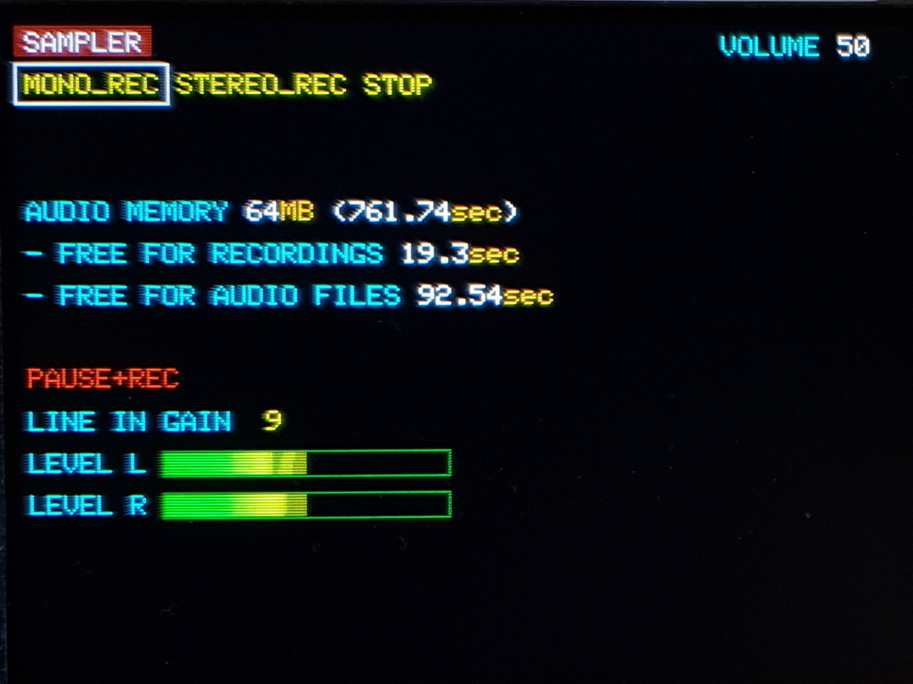

*Les indicateurs d'entrée permettent de régler le gain avant l'enregistrement. Le temps d'enregistrement restant et l'espace libre pour les fichiers audio sont affichés séparément.*

<a id="understand-the-recording-stages"></a>

### Comprendre les étapes d'enregistrement

**Surveillez, enregistrez, arrêtez, auditionnez, puis convertissez ou exportez.**

La surveillance dans `PAUSE+REC` vous permet de préparer la source et les niveaux. `MONO_REC` ou `STEREO_REC` commence la prise. `STOP` y met fin. Ensuite, `MAKE_RAW` crée une source pour un patch, tandis que `EXPORT_WAV_TO_SD` crée un fichier à utiliser en dehors de LILLA.

Le démarrage d'une prise enregistre l'audio pendant 20 ms avant d'accepter l'action de contrôle suivante, permettant ainsi la fin du fondu d'entrée initial. Un Stop immédiat est traité après cette courte pause et préserve la prise. Arrêter ou quitter Sampler attend la fin de l'enregistrement avant de le sauvegarder.

Un enregistrement Flash peut être lu à partir du clavier et édité avant la conversion. Une conversion RAW ou une exportation WAV réussie supprime l'enregistrement source et libère son espace d'enregistrement. Faites d'abord une sauvegarde si vous devez conserver la totalité de la prise originale.

<a id="make-a-recording"></a>

### Effectuer un enregistrement

1. Connectez votre source audio à l'entrée ligne stéréo.
2. Réglez le sélecteur Modes sur **Sampler**.
3. Sélectionnez `PAUSE+REC` pour surveiller l’entrée avant l’enregistrement.
4. Ajustez le gain d'entrée de ligne affiché avec Value lorsque le champ de gain est sélectionné. Surveillez les deux indicateurs de niveau et évitez les pics rouges persistants.
5. Sélectionnez `MONO_REC` ou `STEREO_REC`.
6. Démarrez votre source et regardez le temps écoulé et la mémoire d'enregistrement disponible.
7. Sélectionnez `STOP` lorsque vous avez terminé.
8. Sélectionnez l'enregistrement que vous souhaitez écouter et réglez son volume de lecture si nécessaire.

**Réglez le gain en utilisant la partie la plus forte de la source.** Un niveau qui semble confortable lors d'un passage calme peut écrêter lors d'un accent. Répétez cette section forte dans `PAUSE+REC`, puis enregistrez la prise. Réduire ensuite le volume de lecture ne peut pas annuler la distorsion enregistrée à l’entrée.

L'affichage de la mémoire distingue l'espace disponible pour les enregistrements de l'espace disponible pour les fichiers RAW. Un enregistrement peut tenir même s'il n'y a pas suffisamment d'espace pour le convertir en RAW.

<a id="edit-a-recording-before-conversion-or-export"></a>

### Modifier un enregistrement avant conversion ou exportation

1. Terminez l'enregistrement avec `STOP` ou sélectionnez un enregistrement terminé existant dans Sampler.
2. Appuyez sur **S1** pour un enregistrement mono. Pour la stéréo, appuyez sur **S1** pour le canal gauche ou **S2** pour le canal droit.
3. Dans Sound Edit, lisez l'enregistrement à partir de votre clavier MIDI tout en ajustant ses paramètres de lecture.
4. Utilisez **From** et **To** pour définir le premier et le dernier échantillon, affichés comme limites **A/B**. Utilisez Step pour affiner la région.
5. Ajustez le pitch, le gain, le panoramique, le canal MIDI, la courbe d'attaque, l'enveloppe ADSR, le mode de lecture ou Noclick selon vos besoins.
6. Sélectionnez `RETURN` et appuyez sur Select pour revenir à **SAMPLER**.

La source reste l'enregistrement sélectionné dans Flash ; son audio n'est pas réécrit lorsque vous le coupez ou le modifiez, et le sélecteur de source ne peut pas être modifié dans cet éditeur. La lecture au clavier utilise la région sélectionnée et reste disponible pendant l'édition.

Pour un enregistrement stéréo, chaque paramètre de lecture édité est automatiquement copié sur l'autre canal, y compris A/B, réglage et Auto Tune, gain, panoramique, canal MIDI, courbe d'attaque, ADSR, mode de lecture et Noclick. Les modifications de l’un ou l’autre canal affectent les deux. Les positions panoramiques gauche/droite d'origine restent jusqu'à ce que vous modifiiez le panoramique ; le changement ou le centrage du panoramique applique la même valeur aux deux canaux.

L'éditeur Sampler propose uniquement `RETURN`, sans choix séparé pour enregistrer ou abandonner les modifications. Les limites A/B sont enregistrées automatiquement et conservées pour la lecture et l'exportation ultérieures, même après la sélection d'un autre enregistrement ou le redémarrage de LILLA. Elles sont également conservées en quittant l'éditeur. Les autres paramètres de lecture restent actifs pendant la session d'édition, mais ne sont pas mémorisés comme réglages permanents de l'enregistrement.

La conversion RAW et l'exportation WAV utilisent la région A/B enregistrée, bornes incluses. Les exports stéréo utilisent un début et une fin communs aux deux canaux, avec des durées identiques. Ces opérations copient la région audio choisie ; elles n'appliquent pas à l'audio exporté les réglages de hauteur, d'enveloppe, de gain, de panoramique ou les autres effets de lecture de l'éditeur. Pour exporter la prise complète, replacez d'abord A/B aux limites de l'enregistrement entier.

<a id="make-a-playable-raw-file"></a>

### Créer un fichier RAW jouable

1. Sélectionnez l'enregistrement et, si nécessaire, utilisez S1/S2 pour éditer sa région A/B, puis `RETURN`.
2. Choisissez `MAKE_RAW` et confirmez la conversion.
3. Choisissez la sortie disponible : `MAKE_MONO`, `MAKE_LEFT`, `MAKE_RIGHT` ou `MAKE_BOTH`.
4. Attendez la fin de la conversion.
5. Ouvrez Sound Edit et choisissez la source RAW générée.
6. Enregistrez le patch qui l'utilise.

| Choix de conversion | Résultat |
| --- | --- |
| `MAKE_MONO` | Créez une source mono à partir de l'enregistrement. |
| `MAKE_LEFT` | Créez une source à partir du canal gauche de l'enregistrement stéréo. |
| `MAKE_RIGHT` | Créez une source à partir de son canal droit. |
| `MAKE_BOTH` | Créez des sources gauche et droite distinctes. |

Les choix disponibles dépendent de l'enregistrement sélectionné. Pour les enregistrements stéréo, gauche et droite peuvent devenir des sources RAW distinctes. `CANCEL` sort des choix de conversion. Si LILLA signale qu'il ne peut pas créer de fichier RAW, vérifiez la mémoire RAW libre et les noms de fichiers disponibles.

La conversion copie la région A/B enregistrée. Une fois que tous les fichiers RAW demandés ont été créés avec succès, l'enregistrement Sampler d'origine est supprimé et son espace est libéré. Une conversion échouée conserve l'enregistrement. Sauvegardez la prise originale avant la conversion si vous souhaitez la conserver.

<a id="export-a-wav-file"></a>

### Exporter un fichier WAV

Insérez une carte microSD, sélectionnez un enregistrement et choisissez `EXPORT_WAV_TO_SD`. Le WAV exporté contient sa région A/B enregistrée, préserve la disposition mono ou stéréo de l'enregistrement et utilise le PCM 16 bits à 44,1 kHz.

Les fichiers sont écrits sur `/LILLAWAV_EXPORT`, avec des noms tels que `0M.wav` pour mono ou `0S.wav` pour stéréo. Attendez le message de réussite avant de retirer la carte.

Après une exportation WAV réussie, LILLA supprime l'enregistrement Sampler original et libère son emplacement ainsi que ses paquets Flash. En cas d'échec, l'enregistrement est conservé. Pour garder l'enregistrement dans LILLA tout en disposant d'une copie externe, utilisez plutôt la sauvegarde.

Sampler prend en charge jusqu'à 30 enregistrements. Lorsque chaque emplacement est occupé, `PAUSE+REC` est masqué et une notification temporaire vous demande de supprimer ou d'exporter un enregistrement avant d'enregistrer une autre prise.

L'exportation du WAV est utile lorsque vous souhaitez éditer une prise sur un ordinateur, partager un enregistrement ou conserver une copie audio indépendante de la configuration de LILLA. Cette commande exporte les enregistrements Sampler ; il ne s'agit pas d'une commande d'exportation générale pour chaque source RAW dans Flash.

`CANCEL_RECORDING` supprime l'enregistrement sélectionné. Exportez d’abord tout ce que vous souhaitez conserver.

<a id="live-sampler"></a>

## Live Sampler

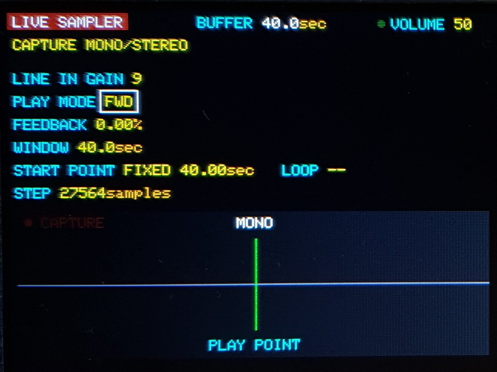

*La vue du tampon vide affiche la capacité, le gain d'entrée, le mode de lecture, les commentaires et les commandes du point de départ.*

Live Sampler enregistre dans un tampon circulaire PSRAM. Il propose environ 40 secondes en mono ou 20 secondes en stéréo. Au fur et à mesure que l'enregistrement se poursuit, le nouvel audio remplace l'ancien contenu du tampon.

Le tampon actif est temporaire et est perdu à la mise hors tension. Utilisez le flux de travail de capture pour patch ci-dessous pour conserver une boucle sélectionnée.

<a id="record-and-explore"></a>

### Enregistrer et explorer

1. Réglez le sélecteur Modes sur **Live Sampler**.
2. Choisissez `MONO/STEREO` avant d'enregistrer. La modification de ce paramètre efface le tampon.
3. Sélectionnez `CAPTURE` pour commencer à enregistrer l'entrée dans le tampon en direct.
4. Sélectionnez `STOP` pour geler l'enregistrement et travailler avec l'audio enregistré.
5. Choisissez un mode de lecture et jouez depuis votre contrôleur MIDI.
6. Tournez From pour ajuster le début de la région et To pour ajuster sa longueur.
7. Tournez Step pour modifier l'incrément d'édition.

<a id="read-and-navigate-the-live-waveform"></a>

### Lire et parcourir la forme d'onde en direct

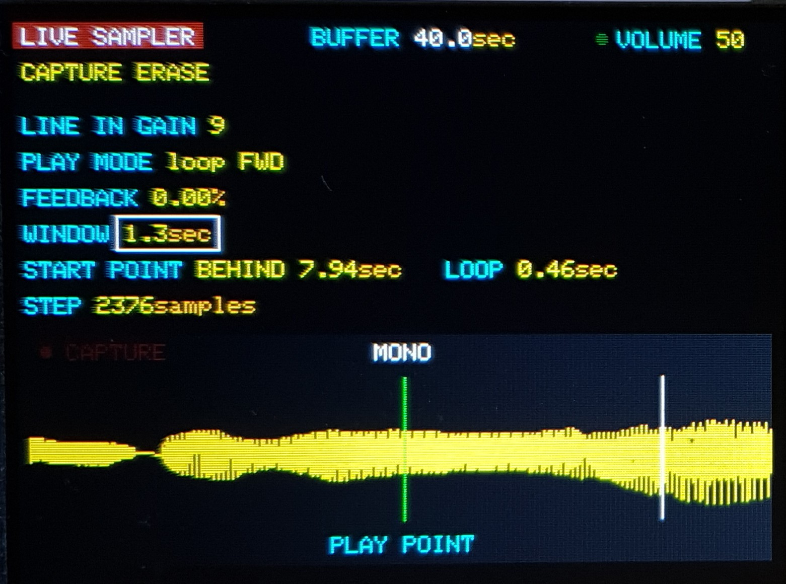

*Ici, la fenêtre d'affichage est de 1,3 seconde, tandis que la boucle sélectionnée est de 0,46 seconde. Le zoom sur la vue et la modification de la longueur de la boucle sont des opérations distinctes.*

| Champ | Signification |
| --- | --- |
| `BUFFER` | Capacité totale d’enregistrement en direct pour la configuration mono/stéréo sélectionnée. |
| `LINE IN GAIN` | Gain appliqué au signal d’enregistrement entrant. |
| `PLAY MODE` | Direction et comportement en boucle. La capture en direct dans un son nécessite un mode boucle. |
| `FEEDBACK` | Quantité de matériel précédent renvoyé pendant l’enregistrement en direct. |
| `WINDOW` | Durée audio visible dans la vue forme d'onde. |
| `START POINT` | Comportement de la position de départ et sa position affichée ou sa relation avec l'enregistrement. |
| `LOOP` | Durée de la région répétitive sélectionnée. |
| `STEP` | Incrément utilisé pour déplacer les contrôles de région. |

Un Window plus petit permet d'inspecter un transitoire ou une boucle courte. Il ne raccourcit pas automatiquement l'audio sélectionné. Utilisez **To** pour ajuster la longueur de la boucle et **From** pour déplacer son début.

Commencez par des commentaires modestes et ajustez tout en écoutant. Les commentaires modifient le matériel enregistré, alors comparez le résultat avant de l’augmenter davantage.

Appuyer sur Step change le comportement de verrouillage du point de départ en direct. **FIXED** occupe un emplacement dans la mémoire tampon circulaire. Le comportement déverrouillé suit la position d'enregistrement et la page peut afficher **SYNC**, **BEHIND** ou une autre position relative en fonction du décalage.

Pour votre première capture, arrêtez l'enregistrement et travaillez sur une région fixe. Une fois que vous êtes à l'aise pour trouver et découper du matériel, essayez un point de départ mobile pendant l'enregistrement. Au fur et à mesure que le tampon s'enroule, l'ancien matériau est remplacé.

`ERASE` efface le tampon enregistré. Changer mono/stéréo le réinitialise également, alors choisissez la disposition avant d'enregistrer le matériel que vous souhaitez conserver.

<a id="continuous-fwd-playback-while-recording"></a>

### Lecture FWD continue pendant l'enregistrement

Pendant l'enregistrement de Live Sampler, les notes maintenues dans **FWD** continuent autour du tampon circulaire au lieu de s'arrêter après une longueur de tampon. Cela s'applique à **SYNC**, positions de départ relatives et **FIXED**, en mono et stéréo. Les notes graves peuvent donc rester actives au-delà de 40 secondes en mono (80 secondes à mi-vitesse). Note-off et l'enveloppe sonore contrôlent toujours la voix.

Lors du premier remplissage, l'accès à l'audio qui n'a pas encore été enregistré s'estompe et arrête la voix. Une fois l'enregistrement terminé, le FWD reprend son comportement normal en un seul coup à partir de la position de lecture actuelle. Les modes inverse et boucle sont inchangés.

<a id="stereo-recording-compressor"></a>

### Compresseur d'enregistrement stéréo

Sur la page Live Sampler, tournez **Select** pour mettre en surbrillance la valeur jaune `ON`/`OFF` à côté de `COMPRESSOR`, puis appuyez sur **Select** pour l'activer. Le contrôle se trouve sur la ligne `FEEDBACK`, alignée sur `LOOP`. Il démarre **off** à la mise sous tension ; son réglage est conservé pendant la session en cours mais n'est pas enregistré dans un patch. Tous les boutons sonores, **S1-S8**, restent disponibles pour la capture dans les emplacements de patch correspondants.

Le compresseur agit sur la somme de l'entrée ligne et du feedback avant d'écrire dans le tampon live. Le traitement audio s'exécute uniquement pendant l'enregistrement du Live Sampler, y compris lorsque sa page Mixer ou Delay est ouverte ; sinon, le bloc draine ses entrées sans allouer de blocs de sortie. Le paramètre ON/OFF est conservé et l’historique d’anticipation est effacé à la reprise de l’enregistrement. La gauche et la droite partagent la même réduction de gain, y compris lors de l'enregistrement d'un mixage mono. Il commence à réduire le gain autour de -6 dBFS et limite les pics d'échantillonnage à environ -1 dBFS une fois complètement activé. Il ne répare pas l'écrêtage déjà survenu à l'entrée ou ailleurs dans le chemin de retour, et ne traite pas le matériel déjà enregistré.

Une analyse anticipée de 128 échantillons ajoute environ 2,9 ms au trajet d'enregistrement, y compris lorsque le compresseur est éteint. La commutation utilise une transition progressive de 10 ms entre des signaux également retardés, de sorte que la chronologie de l'enregistrement ne saute pas. La récupération du gain prend environ 100 ms par constante de temps. Une compression forte peut toujours modifier le comportement du son et du feedback. Pendant le bypass ou la transition vers/depuis le bypass, une protection complète des crêtes n'est pas garantie.

<a id="capture-a-live-loop-into-a-patch"></a>

### Capturer une boucle en direct dans un patch

1. Enregistrez toutes les modifications en attente du patch de performances avant de démarrer ce flux de travail.
2. Enregistrez de l'audio en direct, puis sélectionnez `STOP`.
3. Sélectionnez un mode de lecture **boucle** et affinez la région.
4. Appuyez sur le bouton de l'emplacement **S1-S8** souhaité.
5. Si vous remplacez un emplacement de capture occupé, répondez `REPLACE CAPTURE?` avant de continuer.
6. Lorsque vous y êtes invité, jouez une touche MIDI pour définir la note de référence du son capturé, ou choisissez Annuler.
7. Capturez plus de régions dans d’autres emplacements si vous le souhaitez.
8. Basculez vers Performance, examinez le patch nouvellement créé et choisissez `SAVE`.
9. Attendez la fin des écritures audio en attente avant de mettre hors tension.

La première capture utilise le premier patch normal libre ID en **0-199**. Le patch **200** reste l'espace de travail d'échantillonnage temporaire.

Chaque son capturé est initialement joué sur la touche utilisée pour l'invite de note de référence : ses limites de touche inférieure et supérieure sont définies sur cette même touche. Étendez la plage du clavier dans Performance si vous souhaitez le jouer mélodiquement.

**Attribution d'emplacement stéréo :** sélectionnez un emplacement avec l'emplacement suivant libre, tel que S1 avec S2 libre, pour capturer la gauche et la droite séparément. Les deux sons sont panoramiques à gauche et à droite. Le remplacement d'une paire de capture existante peut réutiliser cette paire. Si un deuxième emplacement n'est pas disponible, y compris une nouvelle capture sur S8, la région sélectionnée est capturée sous forme de mélange mono des deux canaux dans un seul emplacement.

La région sélectionnée doit correspondre au cache de capture et des ressources libres de patches, de sons et de fichiers doivent être disponibles. La mémoire tampon en direct peut être plus longue qu'un son capturé ; raccourcissez la boucle sélectionnée si elle dépasse la limite de capture.

L'audio capturé reste initialement dans PSRAM. L'enregistrement du patch écrit l'audio capturé en attente sous forme de fichiers RAW sur Flash. Attendez la fin de l'enregistrement ; une sauvegarde échouée doit être réessayée avant la mise hors tension.

<a id="if-the-previous-patch-has-unsaved-edits"></a>

### Si le patch précédent contient des modifications non enregistrées

Le message :

> OPEN PERFORMANCE<br>
> AND SAVE THE PREVIOUS PATCH

fait référence au patch Performance utilisé avant de passer à Live Sampler.

1. Arrêtez l'enregistrement en direct s'il est toujours en cours.
2. Retournez à Performance et complétez toute confirmation de sortie.
3. Enregistrez le patch précédent.
4. Revenir à Live Sampler.
5. Sélectionnez la région souhaitée et appuyez à nouveau sur le bouton de la fente sonore.

Il ne vous est pas demandé de sauvegarder le patch 200. L'avertissement protège les modifications apportées au patch normal précédent avant la création d'un nouveau patch capturé.

<a id="capture-messages"></a>

### Messages de capture

| Message | Action suivante |
| --- | --- |
| `NO RECORDED AUDIO` | Enregistrez une entrée avant de la lire ou de la capturer. |
| `STOP REC AND SELECT LOOP MODE` | Arrêtez l'enregistrement et sélectionnez un mode de lecture en boucle. |
| `LOOP TOO LONG FOR CACHE` | Raccourcissez la région sélectionnée. |
| `NO FREE PATCH` | Libérez un emplacement de patch normal après avoir conservé tout ce dont vous avez besoin. |
| `NO FREE SOUND / CACHE / FILE` | Enregistrez le travail en attente et examinez les ressources sonores, de cache audio et de fichiers disponibles. |
| `CAPTURE CACHE UNAVAILABLE` | La mémoire audio requise n'a pas pu être acquise ; conserver le travail en attente avant de réessayer. |
| `SAVE BUSY - TRY AGAIN` | Laissez l'activité audio s'installer et réessayez d'enregistrer. |
| `RAW SAVE FAILED - RETRY` | Réessayez de sauvegarder et laissez l'instrument sous tension pendant que l'audio capturé reste en attente. |

<a id="midi-loop"></a>

## MIDI Loop

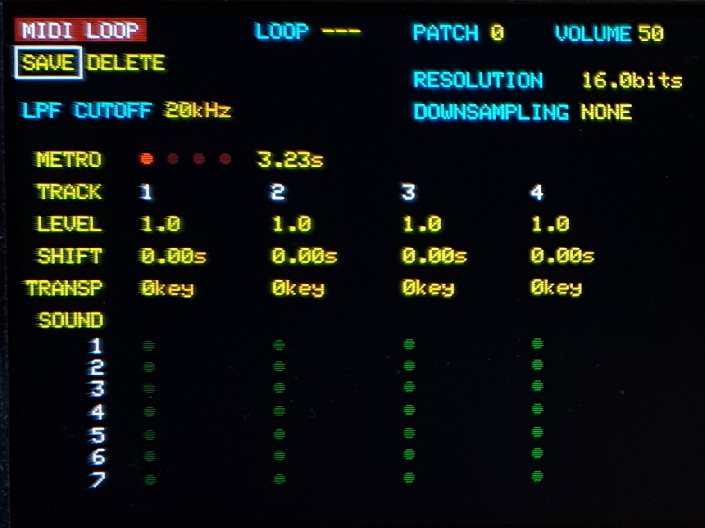

*Les quatre colonnes sont des pistes MIDI. Les indicateurs sonores inférieurs montrent l'activité associée aux sons du patch.*

MIDI Loop enregistre des événements MIDI sur quatre pistes et les lit à travers le patch courant. Track 1 est la piste maître et définit la durée de la boucle.

<a id="record-your-first-loop"></a>

### Enregistrer votre première boucle

1. Insérez une carte microSD pour enregistrer les boucles.
2. Choisissez un patch et vérifiez que votre contrôleur joue les sons prévus.
3. Réglez le sélecteur Modes sur **MIDI Loop**.
4. Appuyez sur **Rec 1**, jouez votre phrase et appuyez à nouveau sur Rec 1 pour fermer l'enregistrement.
5. Écoutez la piste principale répétitive.
6. Appuyez sur Rec 2, Rec 3 ou Rec 4 pour enregistrer une autre piste ; appuyez à nouveau sur ce même bouton Rec pour terminer.
7. Utilisez le menu pour enregistrer la boucle.

L'enregistrement sur une piste occupée remplace ses événements. **Enregistrer à nouveau le Track 1 efface également les autres pistes**, car cela crée une nouvelle boucle principale. Enregistrez une boucle existante avant de remplacer sa piste principale.

Un enregistrement armé sans aucun événement est annulé après environ 20 secondes.

<a id="add-parts-without-replacing-the-master"></a>

### Ajouter des parties sans remplacer la piste maître

Enregistrez d'abord la partie qui définit la longueur de la phrase sur Track 1. Une fois qu'elle se répète correctement, ajoutez une deuxième partie sur Track 2, puis continuez sur les pistes 3 et 4. Utilisez un canal de contrôleur MIDI différent si la nouvelle partie doit adresser un autre son dans un patch multitimbral.

Les événements enregistrés déclenchent les sons actuels du patch. Changer une source, une plage de clavier ou une affectation MIDI peut donc changer le son d'une boucle existante. Conservez le patch et la bibliothèque audio à côté de la boucle lorsque vous souhaitez reproduire l'arrangement ultérieurement.

<a id="play-and-edit"></a>

### Lire et modifier

- Tournez **Loop** pour parcourir les boucles enregistrées.
- Appuyez sur Loop pour arrêter ou redémarrer le groupe de pistes.
- Appuyez sur un encodeur **Track** pour arrêter ou démarrer cette piste individuelle.
- Tournez **Tempo** pour modifier le timing de lecture ; appuyez dessus pour réinitialiser le réglage de la synchronisation.
- Utilisez Select pour choisir la rangée de paramètres de piste, puis tournez chaque encodeur de piste pour modifier le niveau, la hauteur ou le décalage temporel de cette piste.

<a id="understand-the-track-controls"></a>

### Comprendre les commandes des pistes

| Rangée | Ce que ça change | Point de départ |
| --- | --- | --- |
| `LEVEL` | Le niveau de lecture de cette piste. | 1,0 pour un niveau non ajusté. |
| `SHIFT` | Le timing de la piste est décalé dans la boucle. | 0,00 seconde pour aucun décalage. |
| `TRANSP` | La transposition des notes de la piste. | 0 touches pour les notes originales. |

Utilisez un léger Shift pour avancer ou retarder une partie par rapport aux autres pistes. Écoutez à la jonction de la boucle comme au milieu de la phrase. Essayez une autre hauteur avec la transposition, puis remettez-la à zéro pour comparer avec l'original.

Tourner Tempo modifie le timing de la séquence MIDI. Il ne réécrit pas la forme d'onde d'un échantillon ni n'étire automatiquement une phrase audio enregistrée.

<a id="save-loops"></a>

### Enregistrer les boucles

Utilisez `SAVE` pour mettre à jour une boucle enregistrée et `SAVE_AS_NEW` pour conserver une autre version. `NEW` démarre une nouvelle boucle ; `DELETE` supprime une boucle enregistrée.

Les fichiers de boucle sont stockés dans `/LILLALOOP`. Conservez une copie de ce dossier lors de l'archivage de votre travail. Les fichiers de boucle contiennent des données MIDI, donc conservez également le patch requis et l'audio source.

<a id="mixer-delay-and-filters"></a>

## Mixer, Delay et filtres

<a id="mixer"></a>

### Mixer

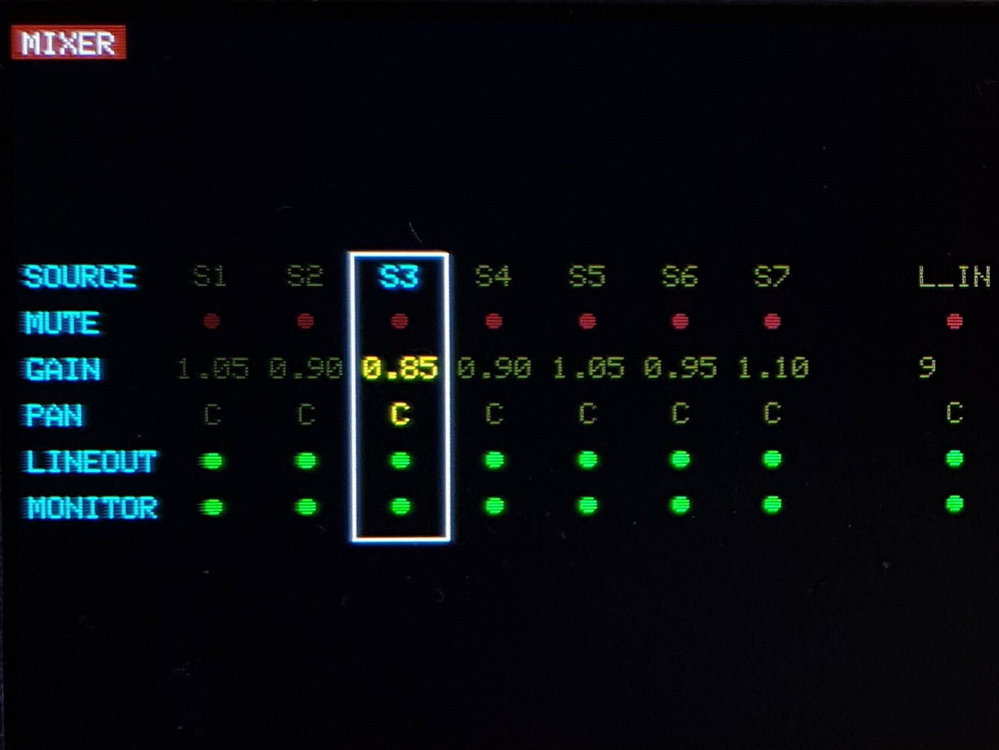

*La colonne en surbrillance correspond à la source sélectionnée. LINEOUT et MONITOR sont des itinéraires distincts.*

Ouvrez **Tools > Mixer** pour régler le gain de la source ou la sourdine, le panoramique et le routage vers les sorties ligne et moniteur. Tournez Select pour choisir une colonne source, puis appuyez dessus pour entrer dans les champs. Tournez Select pour choisir un champ et Value pour modifier son paramètre ; appuyez sur Select pour revenir à la sélection de la source.

Utilisez les itinéraires de ligne et de contrôle séparés pour décider de ce que votre public entend et de ce que vous entendez pendant le contrôle. Si une source est silencieuse, vérifiez sa sourdine/gain et son itinéraire de sortie ainsi que le volume du patch.

<a id="delay"></a>

### Delay

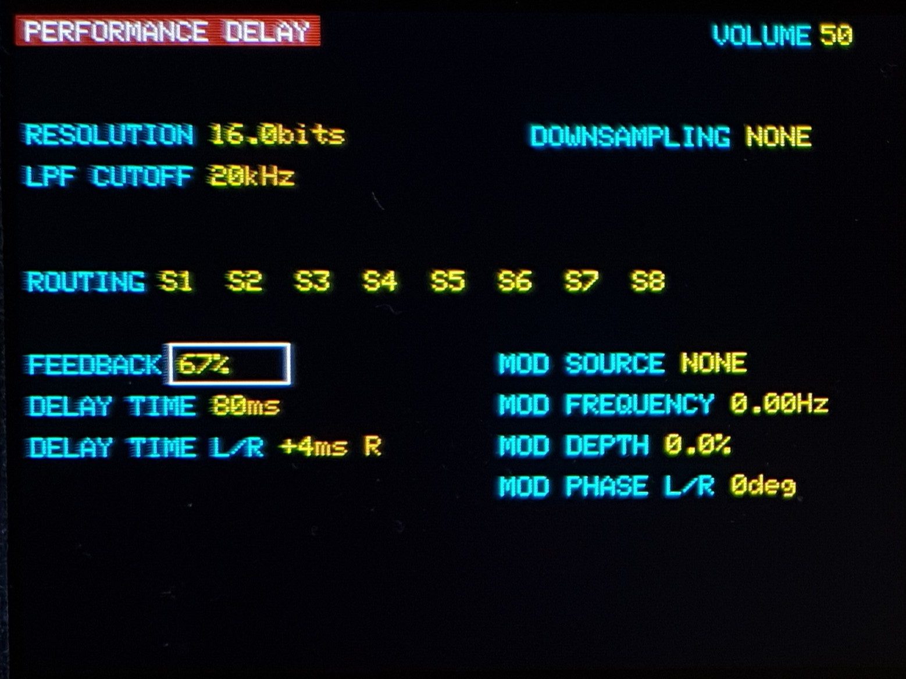

*La rangée ROUTING sélectionne les emplacements sonores qui alimentent le retard. Les exemples de valeurs ne sont pas des valeurs par défaut recommandées.*

Ouvrez **Tools > Delay** pour régler le retour, le temps de retard, la relation temporelle gauche/droite, la source de modulation, la fréquence de modulation, la profondeur de modulation et la phase de modulation gauche/droite.

Commencez avec un faible feedback, puis augmentez-le en écoutant. Vérifiez le routage du retard de l'instrument si vous n'entendez aucun signal retardé. Enregistrez le patch pour conserver ses paramètres de retard.

Pour un premier son de delay, routez un instrument, utilisez un niveau de feedback modeste et choisissez un temps de delay clairement audible. Jouez des notes courtes avec des espaces entre elles pour pouvoir entendre les répétitions. Ajustez ensuite la différence de temps gauche/droite pour la séparation stéréo.

La modulation fait varier le retard dans le temps. Introduisez la profondeur progressivement, puis ajustez son rythme et sa phase gauche/droite pendant l'écoute. Un feedback plus élevé permet aux répétitions de s'accumuler, alors réduisez-le si le signal retardé submerge le son sec.

<a id="filters-and-sound-character"></a>

### Filtres et caractère sonore

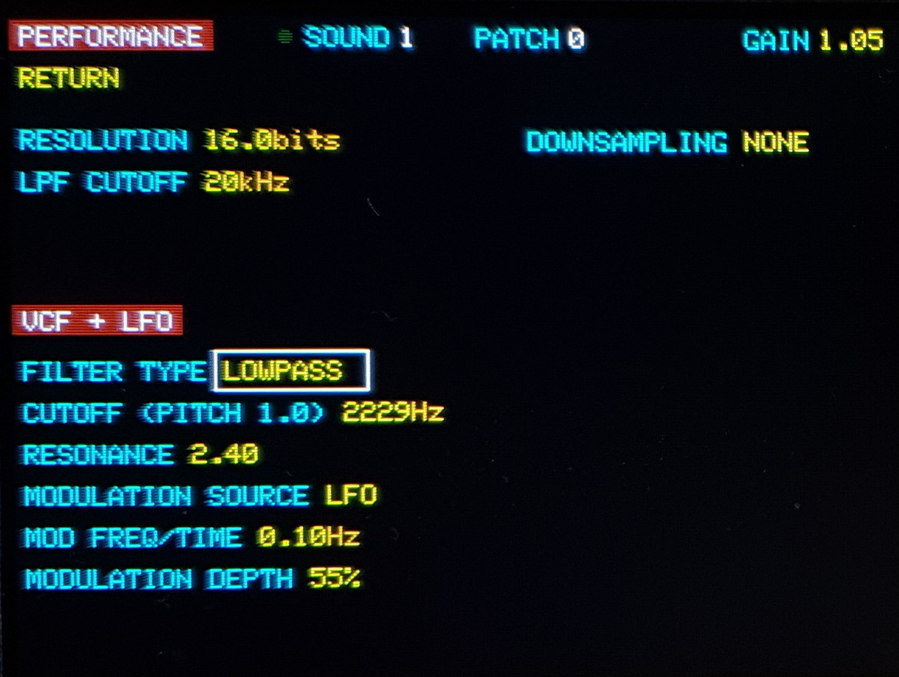

*Le VCF individuel façonne un instrument. Le seuil commun LPF reste visible au-dessus.*

Pour accéder au VCF depuis le Performance, appuyez sur le bouton du son actif pour ouvrir le Sound Edit, puis appuyez à nouveau sur le même bouton du son. Utilisez Select pour mettre en surbrillance un paramètre de filtre et Value pour le modifier.

| Type de filtre | Effet sonore |
| --- | --- |
| Lowpass | Réduit les fréquences au-dessus de la coupure ; utile pour assombrir une source lumineuse. |
| Highpass | Réduit les basses fréquences ; utile pour affiner un son ou supprimer du poids bas de gamme. |
| Bandpass | Accentue une région entre les basses et les hautes fréquences. |
| Notch | Supprime une bande de fréquences. |
| None | Désactive le filtre d'instrument. |

La résonance accentue la réponse du filtre autour de sa fréquence caractéristique. Commencez avec un réglage modéré, puis écoutez tout en déplaçant la coupure. La source et la profondeur de modulation déterminent si et comment ce paramètre évolue dans le temps ; le champ fréquence/temps suit le type de modulation sélectionné.


La commande commune **Cutoff** modifie le filtre passe-bas. Appuyez dessus pour restaurer la coupure maximale. **Resolution** et **Downsampling** ajoutent une coloration numérique.

La page de l'instrument VCF fournit les paramètres de type de filtre, de coupure, de résonance et de modulation. Ajustez-les tout en jouant le son sélectionné afin que vous puissiez entendre comment ils interagissent avec son échantillon et son enveloppe.

Un instrument verrouillé est protégé contre les modifications de performances sélectionnées. Vérifiez `LOCK` si le pitch bend, la résolution ou le sous-échantillonnage semblent n'avoir aucun effet sur ce son.

<a id="setup-and-midi-controls"></a>

## Setup et commandes MIDI

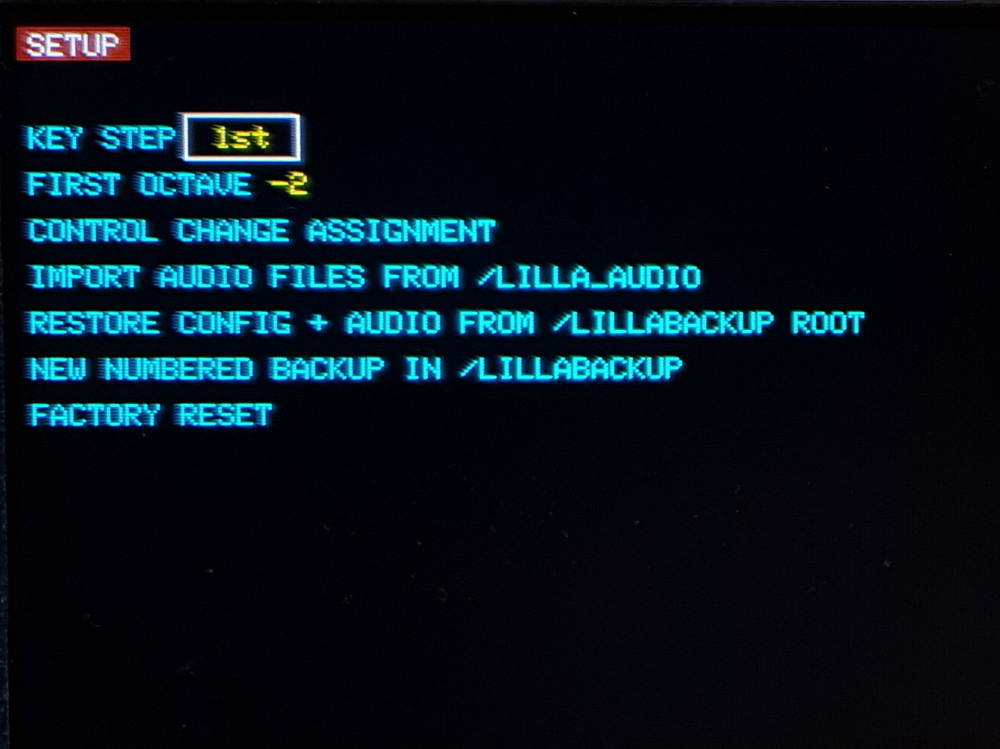

*Setup combine les préférences de lecture globales avec les opérations de bibliothèque audio et de sauvegarde.*

Ouvrez **Tools > Setup** pour :

- `KEY STEP` : incréments de mappage de hauteur d'un demi-ton, d'un demi-demi-ton, d'un quart ou d'un huitième de demi-ton.
- `FIRST OCTAVE` : la convention de nombre d'octave utilisée pour l'affichage des notes.
- `CONTROL CHANGE ASSIGNMENT` : affectations MIDI CC pour les gains du son 1 à 8 et la coupure passe-bas.
- Importation audio, sauvegarde, restauration et réinitialisation d'usine.

<a id="pitch-steps-and-note-names"></a>

### Intervalles de hauteur et noms des notes

Avec `KEY STEP` à un demi-ton, les notes MIDI adjacentes utilisent l'espacement chromatique normal. Des pas plus petits répartissent un intervalle de hauteur plus petit sur chaque pas du clavier, permettant de jouer au demi-, au quart ou au huitième demi-ton. Revenir à un demi-ton lors de la vérification d'un mappage de clavier conventionnel.

`FIRST OCTAVE` modifie la numérotation des octaves utilisée dans l'affichage. Cela permet de correspondre à la convention de dénomination de votre contrôleur ; il ne doit pas être utilisé comme substitut au réglage de la note de référence de l'instrument.

<a id="assign-a-controller-knob"></a>

### Attribuer une commande du contrôleur

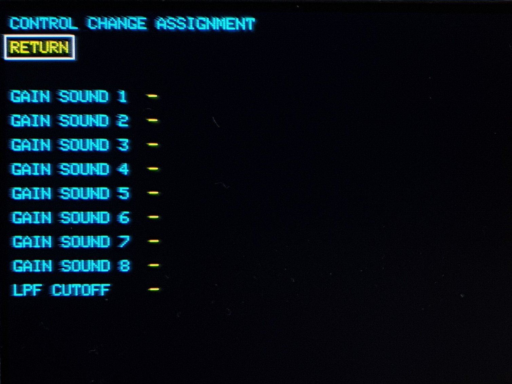

*Chaque destination peut avoir une affectation CC. Un tiret signifie aucune affectation.*

1. Ouvrez `CONTROL CHANGE ASSIGNMENT`.
2. Sélectionnez la destination du gain ou la coupure LPF.
3. Définissez le numéro CC souhaité.
4. Réglez le bouton ou le curseur de votre contrôleur MIDI pour transmettre ce CC.
5. Pour un gain sonore, utilisez le canal MIDI attribué à ce son.
6. Revenez et testez le contrôle pendant que vous jouez.

Utilisez un tiret pour laisser une destination non attribuée. Vérifiez à la fois le numéro du contrôleur et le canal de transmission si le déplacement de la commande externe n'a aucun effet.

<a id="check-incoming-midi"></a>

### Vérifier les messages MIDI entrants

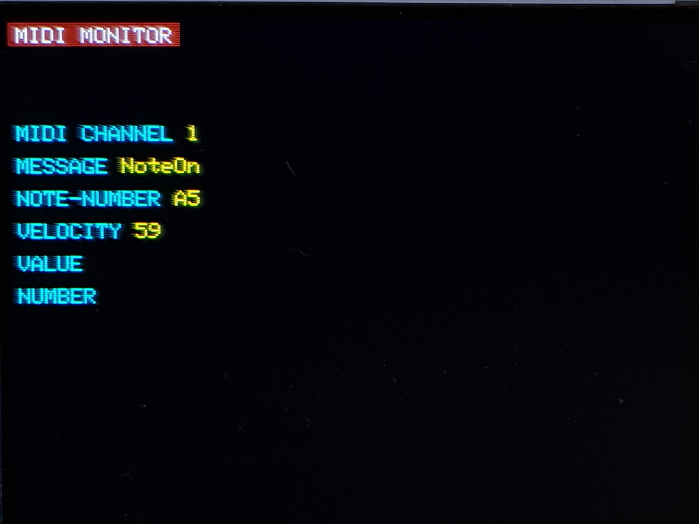

*Cet exemple confirme la réception d'un NoteOn sur le canal 1. Le nom de la note suit la convention actuelle d'affichage d'octave.*

Ouvrez **Tools > Test** pour surveiller les types de messages MIDI entrants. Ceci est utile pour vérifier si le contrôleur envoie des notes, du pitch bend, de l'aftertouch ou des changements de contrôle.

Si le moniteur reçoit des notes mais que le Performance est silencieux, la connexion fonctionne : vérifiez ensuite le mappage des canaux, les plages de touches et le routage audio. Si aucun message n'apparaît, vérifiez la sortie du contrôleur, le câble et la connexion sélectionnée avant d'éditer le patch.

<a id="backup-and-restore"></a>

## Sauvegarde et restauration

<a id="plan-a-complete-archive"></a>

### Prévoir une archive complète

Une sauvegarde de configuration fait partie de la préservation d’une session. Conservez la bibliothèque audio correspondante et les fichiers MIDI-loop avec afin que les paramètres enregistrés contiennent le matériel dont ils ont besoin.

| Article | Sauvegarde numérotée de configuration/enregistrement | Action supplémentaire |
| --- | --- | --- |
| Patchs, sons et configuration enregistrés | Compris. | Enregistrez les modifications actuelles avant de sauvegarder. |
| Associations de noms de fichiers | Compris. | Conservez les noms de base audio correspondants inchangés. |
| Sampler enregistrement audio | Compris. | L'exportation WAV est également utile pour l'accès à l'ordinateur. |
| Sampler enregistrant les limites du A/B | Inclus dans les sauvegardes actuelles. | Les sauvegardes plus anciennes sans métadonnées de découpage restaurent la totalité de la région d'enregistrement. |
| Bibliothèque RAW importée | Non inclus. | Conservez la bibliothèque d'importation d'origine séparément. |
| Fichiers RAW générés à partir d'enregistrements ou de captures en direct | Non inclus en tant qu'archive complète de la bibliothèque RAW-. | Conservez une copie audio récupérable indépendante ; l'enregistrement sur Flash seul n'est pas une sauvegarde externe. |
| Répertoire MIDI-loop | Non inclus. | Copiez `/LILLALOOP` à partir de la carte. |
| Tampon dynamique temporaire | Non inclus. | Capturez et enregistrez le matériel utile avant la mise hors tension. |

Pour une capture Live Sampler, la commande Sampler WAV-export de ce micrologiciel ne fournit pas d'exportation générale de la bibliothèque RAW-. Ne présumez pas qu'une sauvegarde numérotée peut à elle seule restaurer chaque source RAW capturée une fois cette source effacée.

<a id="create-a-backup"></a>

### Créer une sauvegarde

1. Enregistrez vos modifications de patch actuelles.
2. Insérez une carte microSD avec suffisamment d'espace libre.
3. Ouvrez Tools > Setup.
4. Sélectionnez `NEW NUMBERED BACKUP IN /LILLABACKUP` et confirmez.
5. Attendez le message de réussite de la sauvegarde.
6. Copiez le dossier de sauvegarde sur votre ordinateur pour le conserver.

Les sauvegardes sont créées dans des répertoires numérotés tels que `/LILLABACKUP/000001`. Ils contiennent la configuration et l'enregistrement audio Sampler.

Conservez votre bibliothèque source importée séparément. L'opération de sauvegarde ne copie pas l'intégralité de la bibliothèque RAW importée, le tampon dynamique temporaire ou le répertoire MIDI-loop. Copiez `/LILLALOOP` séparément et conservez vos fichiers d'importation. Enregistrez les captures en direct dans un patch avant d'archiver leurs paramètres et tenez compte de la limitation RAW-audio décrite ci-dessus.

<a id="restore-a-backup"></a>

### Restaurer une sauvegarde

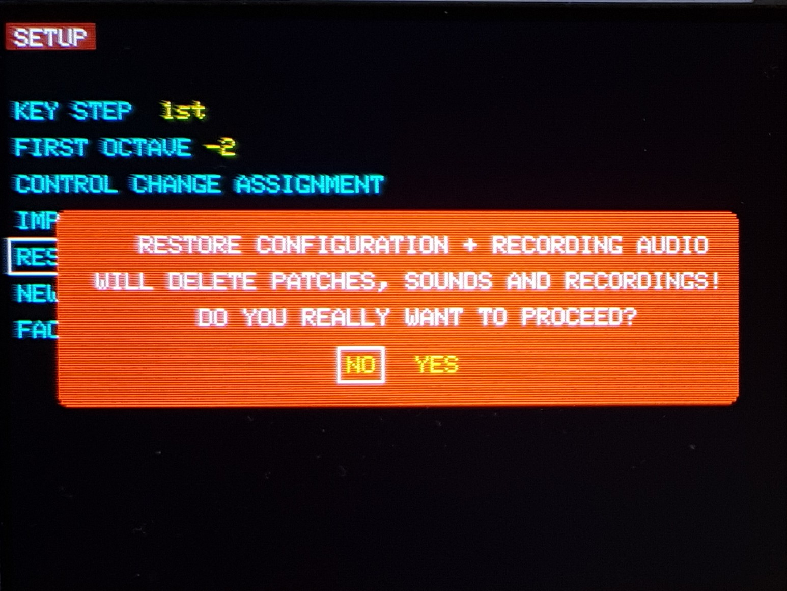

*Choisissez YES uniquement après avoir préparé la sauvegarde prévue dans la racine de sauvegarde de la carte.*

1. Sur votre ordinateur, choisissez la sauvegarde numérotée que vous souhaitez restaurer.
2. Copiez **le contenu** de ce répertoire dans `/LILLABACKUP` sur la carte, en conservant ses fichiers de configuration et d'enregistrement ensemble.
3. Vérifiez que `/LILLABACKUP/LILLA_CONFIG.fram` existe. Le laisser uniquement à l’intérieur de `000001`, par exemple, ne suffit pas.
4. Insérez la carte et ouvrez Tools > Setup.
5. Sélectionnez `RESTORE CONFIG + AUDIO FROM /LILLABACKUP ROOT` et confirmez.
6. Attendez la restauration et tout redémarrage demandé pour terminer.
7. Vérifiez les patches et les enregistrements restaurés et que leurs fichiers source importés sont disponibles.

L'emplacement de restauration devrait ressembler à ceci :

```text
Racine microSD/
  LILLABACKUP/
    LILLA_CONFIG.fram
    [fichiers audio des enregistrements correspondant à la sauvegarde choisie]
```

La ligne entre crochets ci-dessus est une description, pas un nom de fichier à créer. Copiez les fichiers d'enregistrement réels avec la configuration ; ne mélangez pas de fichiers provenant de sauvegardes numérotées différentes.

La restauration remplace la configuration et restaure l'enregistrement audio. Sauvegardez l’état actuel avant d’en restaurer un autre. Conservez la sauvegarde d'origine intacte : un enregistrement audio invalide ou manquant peut empêcher la récupération d'un enregistrement.

<a id="factory-reset"></a>

### Rétablir les réglages d'usine

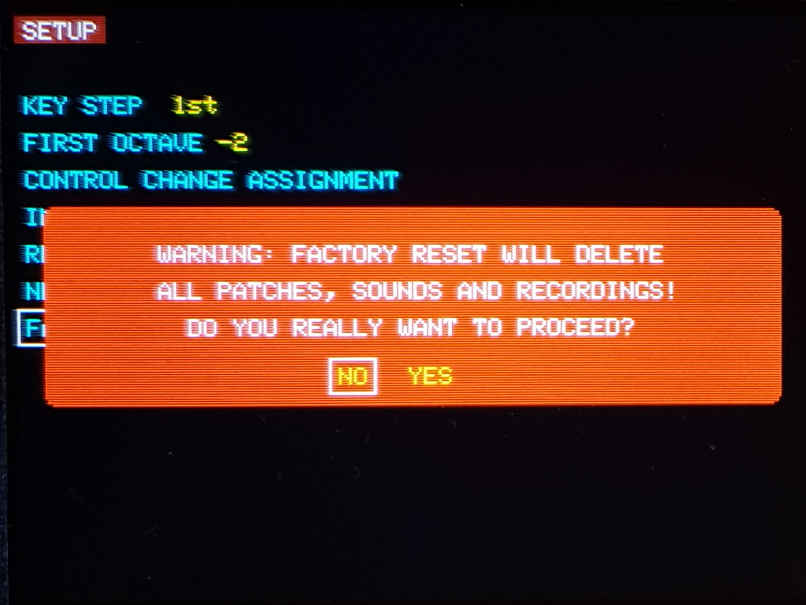

*La réinitialisation d'usine est une opération de configuration destructrice, et non un moyen de quitter une page d'édition.*

`FACTORY RESET` supprime les patchs, les sons et les enregistrements. Faites une sauvegarde avant de confirmer. Attendez la fin de la réinitialisation et du redémarrage.

<a id="updating-the-firmware-on-windows"></a>

## Mettre à jour le firmware sous Windows

Le firmware est le programme qui fait fonctionner LILLA. Pour transférer un firmware compilé sous Windows 10 ou 11, utilisez **Teensy Loader (`teensy.exe`)**. Cette application autonome se télécharge et s'exécute sans installation. **Teensyduino** est l'extension de développement Arduino ; ni cette extension, ni Arduino IDE ou PlatformIO ne sont nécessaires pour transférer le fichier HEX fourni. La [page de téléchargement de PJRC](https://www.pjrc.com/teensy/td_download.html) distingue les outils de développement du loader autonome.

<a id="what-you-need"></a>

### Matériel nécessaire

- Votre instrument LILLA, qui utilise un Teensy 4.1.
- Un ordinateur Windows 10 ou 11.
- Un câble **données** USB correspondant à l'ordinateur et au connecteur USB-C de LILLA. Un câble de chargement uniquement ne peut pas transférer le micrologiciel.
- Le fichier du micrologiciel LILLA, par exemple `Lilla_v7_0_2.hex`.
- Teensy Loader, téléchargé à partir de PJRC.

<a id="download-the-firmware"></a>

### Télécharger le firmware

1. Ouvrez la [branche principale du référentiel GitHub LILLA](https://github.com/SandroGrassia/Lilla_Audio_Sampler/tree/main). Confirmez que le sélecteur de branche affiche **main**.
2. Dans la liste de fichiers de niveau supérieur du projet, ouvrez le fichier `.hex` publié pour votre instrument, par exemple `Lilla_v7_0_2.hex`. Il s'agit du firmware compilé ; **Code > Télécharger ZIP** télécharge les sources du projet à la place.
3. Sur la page du fichier HEX, cliquez sur **Télécharger le fichier brut**. Téléchargez le micrologiciel uniquement à partir de **main**. La branche **develop** contient des travaux en cours et peut contenir des builds défectueuses ou non testées.
4. Enregistrez le fichier dans un dossier que vous pouvez trouver facilement, tel que `Downloads/LILLA`. Vérifiez que son nom se termine par `.hex` et non par `.html` ou `.txt`.

Les numéros de version dans `Lilla_v7_0_2.hex` identifient la version et la révision du micrologiciel. Conservez la copie téléchargée si vous souhaitez conserver cette version exacte. Si aucun fichier HEX n'est disponible sur **main**, attendez que le responsable le publie ; ne remplacez pas un fichier de **develop**.

<a id="download-teensy-loader"></a>

### Télécharger Teensy Loader

Ouvrez la [page officielle de Teensy Loader pour Windows de PJRC](https://www.pjrc.com/teensy/loader_win10.html) et cliquez sur **Teensy Loader Program**. Enregistrez `teensy.exe` et double-cliquez dessus. La petite fenêtre de Teensy Loader doit apparaître. Vous pouvez conserver l'exécutable dans le même dossier que le fichier HEX. Les [instructions de première utilisation de PJRC](https://www.pjrc.com/teensy/first_use.html) expliquent que le mode de programmation utilise les pilotes USB intégrés à Windows ; aucun pilote de programmation supplémentaire n'est nécessaire.

<a id="prepare-lilla"></a>

### Préparer LILLA

Enregistrez votre patch actuel et toutes les boucles MIDI, et terminez les opérations d'enregistrement ou d'exportation en attente. Utilisez [Sauvegarde et restauration](#backup-and-restore) pour conserver votre travail avant de modifier le micrologiciel. Vérifiez les instructions de compatibilité ou de migration fournies avec la nouvelle version.

Baissez le niveau de votre amplificateur ou mixeur, puis connectez le connecteur USB-C de LILLA à l'ordinateur avec le câble de données. Gardez l'alimentation et le USB connectés tout au long de la programmation.

<a id="upload-and-restart"></a>

### Transférer et redémarrer

1. Dans Teensy Loader, laissez le **Mode automatique** désactivé pour cette procédure manuelle.
2. Choisissez **Fichier > Ouvrir le fichier HEX** et sélectionnez le `Lilla_v7_0_2.hex` téléchargé. Confirmez le nom de fichier affiché dans le chargeur.
3. Appuyez brièvement et relâchez le bouton **Firmware_upload mode** de LILLA. Il s'agit du bouton de programmation, pas du bouton On/off. Le programme en cours de l'instrument s'arrête et le chargeur devrait détecter le Teensy.
4. Choisissez **Opérations > Programme**. Attendez **Téléchargement terminé** avant de déconnecter quoi que ce soit.
5. Choisissez **Opérations > Redémarrer**. LILLA devrait redémarrer.
6. Vérifiez la version du micrologiciel sur l'écran d'accueil de LILLA. L'écran de bienvenue devrait afficher la version 7.0.2. Chargez un patch familier et vérifiez la lecture à un niveau d'écoute faible.

Les commandes manuelles ci-dessus suivent les [instructions du chargeur Windows PJRC](https://www.pjrc.com/teensy/loader_win10.html). Mettre à jour les programmes du micrologiciel dans la mémoire de programme interne du Teensy ; l'importation de l'audio depuis la carte SD est une opération distincte.

<a id="if-the-upload-does-not-start"></a>

### Si le transfert ne démarre pas

| Symptôme | Que vérifier |
| --- | --- |
| Le chargeur ne détecte pas LILLA | Appuyez et relâchez le bouton Firmware_upload mode après avoir connecté le USB. Essayez un câble de données connu et un autre port USB de l'ordinateur. |
| Le fichier HEX ne peut pas être ouvert | Téléchargez à nouveau le fichier brut `.hex`. Vérifiez que vous n'avez pas enregistré la page Web GitHub ou une archive source. |
| La programmation se termine mais LILLA ne démarre pas | Choisissez Opérations > Redémarrer une fois le téléchargement terminé. Si nécessaire, reconnectez-vous et répétez avec le micrologiciel LILLA correct. |
| L'écran d'accueil affiche l'ancienne version | Vérifiez quel fichier HEX est ouvert dans le chargeur et répétez le programme, suivi de Redémarrer. |

<a id="updating-the-firmware-on-mac"></a>

## Mettre à jour le firmware sur Mac

Sous macOS, utilisez l'application autonome **Teensy Loader** et le fichier LILLA `.hex` publié. Arduino IDE, PlatformIO et le module complémentaire de développement Teensyduino ne sont pas requis pour télécharger un firmware compilé. PJRC répertorie le chargeur autonome sur sa [page de téléchargement](https://www.pjrc.com/teensy/td_download.html).

<a id="what-you-need-on-mac"></a>

### Matériel nécessaire sur Mac

- Votre instrument LILLA, qui utilise un Teensy 4.1.
- Un Mac compatible avec le téléchargement actuel Teensy Loader.
- Un câble **données** USB correspondant au connecteur Mac et LILLA USB-C. Si un adaptateur est nécessaire, il doit prendre en charge les données USB.
- Le fichier LILLA HEX publié et l'application macOS Teensy Loader.

<a id="download-the-firmware-on-mac"></a>

### Télécharger le firmware sur Mac

1. Dans votre navigateur, ouvrez la [branche principale du référentiel GitHub LILLA](https://github.com/SandroGrassia/Lilla_Audio_Sampler/tree/main). Confirmez que le sélecteur de branche affiche **main**.
2. Ouvrez le fichier `.hex` publié dans la liste de fichiers de niveau supérieur du projet, par exemple `Lilla_v7_0_2.hex`.
3. Cliquez sur **Télécharger le fichier brut** et enregistrez-le dans un dossier pratique, tel que `Downloads/LILLA`.
4. Dans le Finder, confirmez que le fichier téléchargé se termine par `.hex`. Une page Web GitHub ou une archive source **Code > Télécharger ZIP** ne peut pas être chargée en tant que micrologiciel.

Utilisez le micrologiciel de **principal** uniquement. Les fichiers sur **develop** sont en cours de travail et peuvent être défectueux ou non testés. Si main n'a pas de fichier HEX, attendez que le responsable le publie. Conservez la copie téléchargée pour conserver cette version exacte.

<a id="download-and-open-teensy-loader-on-mac"></a>

### Télécharger et ouvrir Teensy Loader sur Mac

1. Ouvrez la [page officielle du chargeur Mac PJRC](https://www.pjrc.com/teensy/loader_mac.html) et téléchargez **Teensy Loader Disk Image**.
2. Dans le Finder, ouvrez le fichier `.dmg` téléchargé. Il contient l'application Teensy Loader.
3. Copiez l'application dans **Applications** pour une réutilisation pratique, puis ouvrez-la. Confirmez **Ouvrir** si macOS vous pose des questions sur l'application téléchargée.

Si macOS bloque une application non vérifiée, vérifiez d'abord qu'elle provient du téléchargement officiel PJRC. Après avoir tenté de l'ouvrir, utilisez **Menu Pomme > Paramètres système > Confidentialité et sécurité > Ouvrir quand même**, puis confirmez **Ouvrir**, si cette option est disponible. Suivez [les instructions d'Apple pour ouvrir les applications téléchargées](https://support.apple.com/en-us/102445) ; ne désactivez pas la sécurité macOS globalement. Si le chargeur signale un système non pris en charge, obtenez une version compatible auprès de PJRC.

<a id="prepare-lilla-on-mac"></a>

### Préparer LILLA sur Mac

Enregistrez votre patch et vos boucles MIDI, terminez les opérations d'enregistrement ou d'exportation en attente et effectuez une sauvegarde à l'aide de [Sauvegarde et restauration](#backup-and-restore). Lisez toutes les instructions de compatibilité ou de migration accompagnant le micrologiciel.

Baissez le niveau d’écoute. Connectez le connecteur USB-C de LILLA au Mac avec le câble de données et maintenez l'alimentation et le USB connectés tout au long de la programmation. Autorisez la connexion de l'accessoire USB si votre Mac demande l'autorisation.

<a id="upload-and-restart-on-mac"></a>

### Transférer et redémarrer sur Mac

1. Laissez le **Mode automatique** du Teensy Loader désactivé.
2. Choisissez **Fichier > Ouvrir le fichier HEX** et sélectionnez le fichier LILLA HEX téléchargé.
3. Appuyez brièvement et relâchez le bouton **Firmware_upload mode** de LILLA, plutôt que le bouton On/off. Le chargeur devrait détecter le Teensy.
4. Choisissez **Opérations > Programme** et attendez la fin du téléchargement**.
5. Choisissez **Opérations > Redémarrer** pour redémarrer LILLA.
6. Vérifiez la version sur l'écran d'accueil et testez un patch familier à un faible niveau d'écoute. Pour cette version, l'écran de bienvenue doit afficher la version 7.0.2.

Ces commandes sont décrites dans les [instructions du chargeur Mac PJRC](https://www.pjrc.com/teensy/loader_mac.html).

<a id="if-the-mac-cannot-upload"></a>

### Si le transfert échoue sur Mac

| Symptôme | Que vérifier |
| --- | --- |
| Teensy Loader ne s'ouvre pas | Vérifiez la source de téléchargement, l'invite d'autorisation macOS et la configuration système requise du chargeur. |
| LILLA n'est pas détecté | Reconnectez le USB, autorisez l'accessoire si vous y êtes invité et appuyez brièvement sur Firmware_upload mode. Essayez un autre câble de données, port ou adaptateur. |
| Le HEX ne peut pas être ouvert | Téléchargez à nouveau le HEX brut depuis main et vérifiez son extension dans le Finder. |
| La programmation est terminée mais LILLA ne redémarre pas | Choisissez Opérations > Redémarrer une fois le téléchargement terminé. |

<a id="troubleshooting"></a>

## Dépannage

<a id="diagnose-silence-in-a-useful-order"></a>

### Rechercher méthodiquement la cause d'une absence de son

1. **MIDI :** Tools > Test affiche-t-il les notes entrantes ?
2. **Mapping :** un son actif est-il attribué à ce canal et à cette plage de notes ?
3. **Source :** la source audio attendue est-elle présente et la région est-elle valide ?
4. **Enveloppe et niveau :** le gain et le maintien sont-ils suffisants, et l'attaque est-elle inhabituellement longue ?
5. **Routage :** la source est-elle activée et dirigée vers la sortie utilisée ?
6. **Sortie :** le volume du patch, le niveau du mixeur externe et la connexion physique sont-ils corrects ?

Changez une chose à la fois et retestez avec la même note. Cela facilite l’identification de la cause réelle.

| Problème | Que vérifier |
| --- | --- |
| Aucun son du contrôleur | Connexion MIDI, canal instrument MIDI, plage du clavier, disponibilité de la source, gain, volume du patch et routage de sortie Mixer. |
| Un emplacement ne s'ouvrira pas pour l'édition | L'emplacement est peut-être inutilisé. Modifiez un emplacement actif ou clonez un instrument existant en un instrument libre. |
| L'échantillon sonne trop haut ou trop bas | Touche racine, hauteur sonore, pitch bend du contrôleur et étape clé Setup. |
| Clips audio ou distorsions | Réduisez le gain d’entrée d’enregistrement ou le gain de lecture. Vérifiez les niveaux, la résolution et le sous-échantillonnage du Mixer. |
| Clics à la jonction d'une boucle | Affinez From/To et ajustez Noclick lorsque ce réglage est disponible. |
| Moins de notes sont jouées que prévu | LILLA dispose de 16 voix au maximum ; les superpositions consomment plusieurs voix et une lecture plus exigeante peut réduire les ressources disponibles. Vérifiez les priorités et la densité de l'arrangement. |
| L'importation depuis la SD ne trouve pas les fichiers | Vérifiez la carte et le dossier `/LILLA_AUDIO` à sa racine, avec ce nom exact. |
| L'importation refuse un WAV ou un AIFF | Utilisez du PCM non compressé, 16 bits, à 44,1 kHz, avec un ou deux canaux. |
| L'importation signale des fichiers en double | Donnez à chaque source un nom de base distinct, y compris entre fichiers de formats différents. |
| Un échantillon importé se termine trop tôt | Vérifiez la limite d'importation d'environ 35,7 secondes. |
| La conversion RAW échoue | Vérifiez l'espace disponible pour les fichiers RAW et les noms de fichiers disponibles. |
| L'exportation WAV échoue | Vérifiez que la carte SD est présente, accessible en écriture et dispose d'espace libre. |
| L'audio en direct disparaît | Le tampon en direct est temporaire. Capturez la boucle souhaitée dans un patch et enregistrez-le avant d'éteindre l'instrument. |
| Live Sampler demande d'ouvrir Performance et d'enregistrer | Le patch normal précédent contient des modifications non enregistrées. Revenez à Performance, enregistrez-le, puis recommencez la capture. |
| La capture en direct est refusée | Arrêtez l'enregistrement, sélectionnez un mode de boucle, raccourcissez la région si nécessaire et enregistrez les modifications du patch existant. |
| Des pistes disparaissent après un nouvel enregistrement de Track 1 | Track 1 définit une nouvelle boucle et efface les autres pistes. |
| La restauration ne trouve pas la sauvegarde | Placez `LILLA_CONFIG.fram` et les fichiers d'enregistrement correspondants directement dans `/LILLABACKUP`. |
| Un patch restauré ne peut pas lire sa source | Restaurez ou réimportez la bibliothèque audio nécessaire ; la sauvegarde de configuration ne contient pas tous les fichiers audio importés. |

<a id="practical-projects"></a>

## Projets pratiques

<a id="make-a-playable-instrument-from-a-recorded-note"></a>

### Créer un instrument jouable à partir d'une note enregistrée

**Matériel nécessaire :** une source reliée à l'entrée ligne et un contrôleur MIDI.

1. Dans Sampler, utilisez `PAUSE+REC` pour régler le niveau d'entrée.
2. Enregistrez une note tenue propre en mono, avec son attaque et sa décroissance.
3. Arrêtez, appuyez sur S1 pour écouter au clavier, ajustez A/B et sélectionnez `RETURN`. Faites maintenant une sauvegarde si vous souhaitez conserver l'enregistrement original complet.
4. Utilisez `MAKE_RAW` pour créer une source jouable à partir de la région sélectionnée ; une conversion réussie supprime l'enregistrement.
5. Dans Performance, clonez un patch qui servira de point de départ.
6. Ouvrez un son actif et choisissez la nouvelle source.
7. Retirez les silences indésirables, choisissez un mode de lecture et ajustez l'enveloppe.
8. Réglez la note de référence sur la note enregistrée, puis définissez la plage du clavier.
9. Jouez au-dessus et au-dessous de la note de référence pour vérifier le résultat.
10. Enregistrez le patch. Conservez la sauvegarde effectuée avant conversion si vous avez besoin de l'enregistrement original ; après conversion, la prise n'est plus disponible pour l'exportation WAV de Sampler.

**Pour aller plus loin :** clonez le son dans un autre emplacement, choisissez une autre région de la même source et attribuez des zones de clavier séparées aux deux emplacements.

<a id="turn-live-audio-into-a-small-playable-kit"></a>

### Créer un petit kit jouable à partir d'audio en direct

**Matériel nécessaire :** plusieurs événements courts dans le tampon Live Sampler et un patch Performance déjà enregistré.

1. Enregistrez la source dans Live Sampler, puis arrêtez.
2. Sélectionnez un mode de boucle et repérez le premier événement utile avec From, To et Window.
3. Appuyez sur S1 et jouez la note de déclenchement souhaitée lorsque l'instrument le demande.
4. Déplacez la région vers un deuxième événement.
5. Appuyez sur un autre emplacement libre et choisissez une autre note de déclenchement.
6. Répétez l'opération pour les événements restants, en prévoyant deux emplacements pour chaque capture stéréo.
7. Passez à Performance et vérifiez les notes de déclenchement attribuées.
8. Ouvrez chaque son pour choisir son mode final, lecture unique ou boucle, et son enveloppe.
9. Enregistrez le patch et attendez la fin de l'écriture de son audio en Flash.

**Résultat :** un patch normal dont les emplacements contiennent différentes régions capturées. Le tampon en direct original reste un espace de travail temporaire.

<a id="build-a-layered-texture-and-animate-it"></a>

### Créer et animer une texture sonore superposée

1. Partez d'un patch enregistré et clonez un son dans un emplacement libre.
2. Attribuez aux deux emplacements le même canal MIDI et des plages de clavier qui se chevauchent.
3. Utilisez des régions de découpe ou des réglages de hauteur différents pour les deux couches.
4. Réduisez leurs gains individuels avant d'écouter leur combinaison.
5. Ouvrez le VCF d'une couche et ajoutez une modulation lente de faible profondeur.
6. Dirigez une couche ou les deux vers Delay et ajoutez un peu de réinjection.
7. Jouez des notes tenues et écoutez les fins de relâchement.
8. Enregistrez le patch lorsque l'équilibre vous convient.

**Pour aller plus loin :** enregistrez une courte phrase sur Track 1 de MIDI Loop, ajoutez une partie contrastante sur Track 2 et essayez un léger décalage Shift sur la deuxième piste.

<a id="quick-reference"></a>

## Aide-mémoire

| Tâche | Point de départ |
| --- | --- |
| Jouer un patch existant | Performance > champ du patch > Value. |
| Modifier un son | Performance > S1-S8 pour un emplacement actif. |
| Ajouter un instrument à partir d'un son existant | Sound Edit > CLONE, puis modifier le nouvel emplacement. |
| Conserver les modifications des sons après l'extinction | Revenir à Performance > SAVE. |
| Importer de l'audio depuis l'ordinateur | SD `/LILLA_AUDIO` > Tools > Setup > importation. |
| Enregistrer l'entrée ligne | Sampler > PAUSE+REC > MONO_REC ou STEREO_REC > STOP. |
| Modifier un enregistrement en le jouant au clavier | Sampler > enregistrement terminé > S1 (mono/gauche) ou S2 (stéréo droite) > Sound Edit > RETURN. |
| Conserver les limites de découpe pour la lecture et l'exportation | Ajuster A/B dans Sound Edit de Sampler ; sauvegarde automatique et canaux stéréo liés. |
| Transformer un enregistrement en source | Sampler > MAKE_RAW. |
| Exporter un enregistrement | Sampler > EXPORT_WAV_TO_SD > SD `/LILLAWAV_EXPORT`. |
| Enregistrer temporairement l'audio en direct | Live Sampler > CAPTURE > STOP. |
| Conserver une boucle en direct | Arrêter l'enregistrement en direct > mode de boucle > S1-S8 > définir la note de référence > enregistrer le patch. |
| Enregistrer une boucle MIDI | MIDI Loop > Rec 1 > jouer > Rec 1 à nouveau. |
| Sauvegarder la configuration et les enregistrements | Tools > Setup > nouvelle sauvegarde numérotée. |
| Restaurer une sauvegarde numérotée | Copier son contenu dans `/LILLABACKUP` sur la SD > Tools > Setup > restauration. |

<a id="glossary"></a>

## Glossaire

| Terme | Dans ce guide |
| --- | --- |
| ADSR | Attaque, décroissance, maintien et relâchement : les étapes qui façonnent le niveau d'un son au fil du temps. |
| Nom de base | Nom d'un fichier sans son extension, comme `BassDry` dans `BassDry.wav`. |
| Capture | Dans le menu Live Sampler, enregistrer dans le tampon en direct ; avec S1-S8, copier une région sélectionnée dans un son du patch. |
| Tampon circulaire | Mémoire d'enregistrement qui revient au début et écrase les données les plus anciennes. |
| Flash | Mémoire audio persistante à l'intérieur de LILLA. |
| FRAM | Mémoire persistante pour la configuration et les métadonnées des patches et des sons. |
| LFO | Oscillateur basse fréquence permettant de faire varier un paramètre dans le temps. |
| LPF | Filtre passe-bas qui atténue les fréquences élevées. |
| MIDI CC | Message MIDI Control Change utilisé pour commander un paramètre attribué. |
| Mono | Un canal audio. |
| Noclick | Lissage des jonctions pour réduire les discontinuités dans les régions de boucle adaptées. |
| PCM | Données numériques d'échantillons audio non compressées. |
| Polyphonie | Nombre de voix de lecture simultanées ; les couches et les fins de relâchement utilisent également des voix. |
| PSRAM | Mémoire de travail audio dont le contenu est perdu à l'extinction. |
| RAW | Données d'échantillons audio sans en-tête de conteneur WAV ou AIFF. |
| Note de référence | Note MIDI servant de référence pour la correspondance de hauteur d'un son. |
| Stéréo | Deux canaux audio, gauche et droit. |
| VCF | Filtre de l'instrument, avec réglages de fréquence de coupure, résonance et modulation. |

---

*Lilla Guide utilisateur - Édition française - 8 octobre 2026*

*Images du guide : [doc/assets/images](doc/assets/images/). Conservez ce chemin relatif lorsque vous partagez le guide illustré.*
