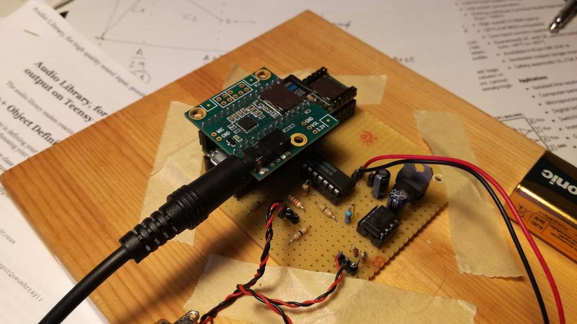
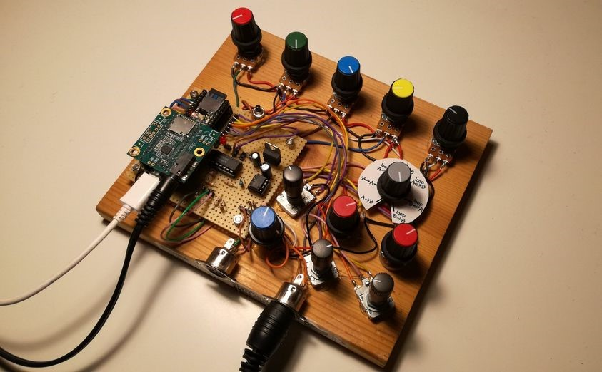
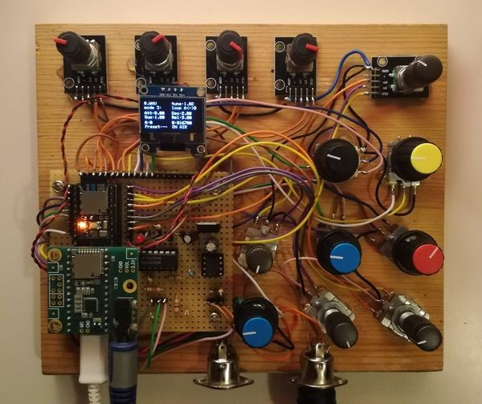
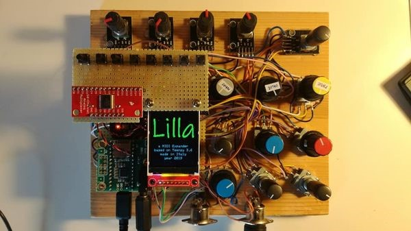
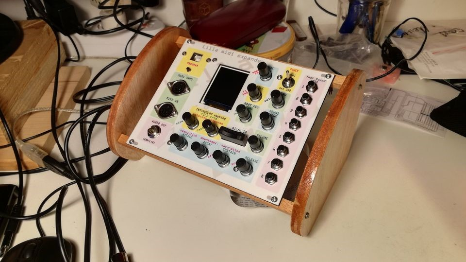
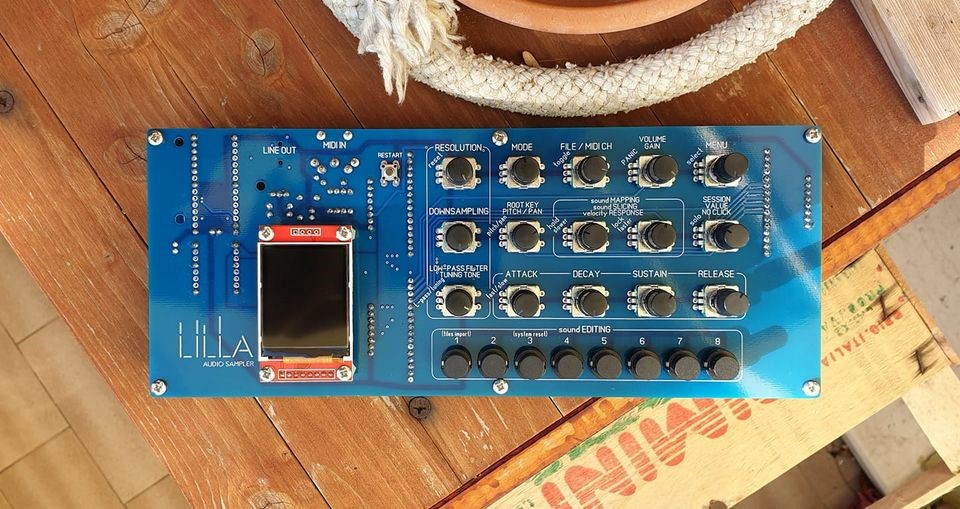
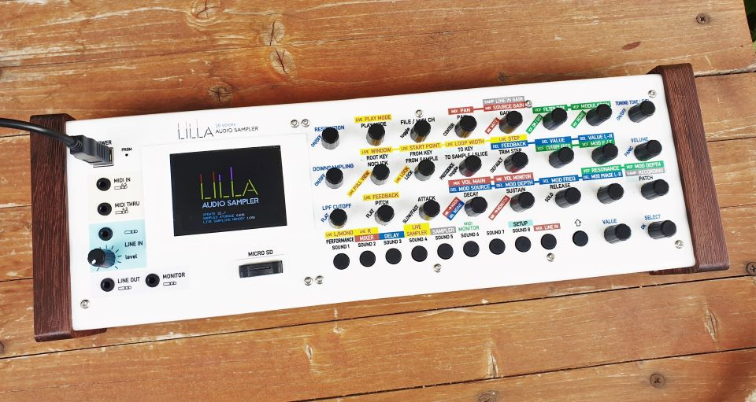
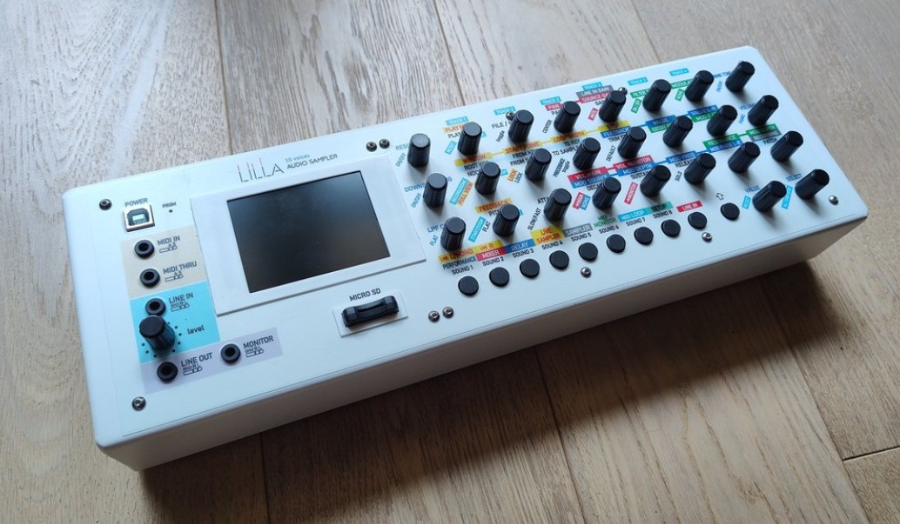

<p align="center">
	
</p>

# LILLA Audio Sampler 2026

This repository contains the PlatformIO firmware project for the LILLA Audio Sampler, a Teensy 4.1 based hardware sampler designed and assembled in Italy.

The codebase targets a Teensy 4.1 running at 600 MHz and is organized as a standalone PlatformIO project with custom audio, display, storage, MIDI, and user-interface modules.

## What This Project Does

LILLA is a polyphonic, multitimbral, multi-MIDI audio sampler designed to work with imported audio, self-recorded audio, and live input.

Main operating modes:

- Performance mode with patches made of 1 to 8 sounds
- Sampler mode for recording and exporting audio to micro SD
- Live Sampler mode using PSRAM as temporary audio memory
- MIDI Loop mode for loop-based MIDI performance

## Hardware Summary

The firmware is written for a hardware platform built around:

- Teensy 4.1
- Teensy Audio Adaptor Rev D
- 64 MB SPI flash memory
- 16 MB total QSPI PSRAM
- ILI9341 SPI display
- MCP23S17 shift-register based I/O expansion
- MIDI input and output
- stereo line input and output
- monitor output and phones output
- gate input and output
- micro SD storage

## Wiring And Pinout

The table below only lists connections that are explicitly defined or strongly implied by this codebase.

| Function | Device / Bus | Pins or addresses confirmed in code | Notes |
|---|---|---|---|
| Display SPI clock | ILI9341 on custom SPI1 wiring | SCK = 27 | Defined in `lib/config/config.h` |
| Display SPI data out | ILI9341 on custom SPI1 wiring | MOSI = 26 | Defined in `lib/config/config.h` |
| Display command/data | ILI9341 | DC = 29 | Defined in `lib/config/config.h` |
| Display reset | ILI9341 | RST = 30 | Defined in `lib/config/config.h` |
| Display chip select | ILI9341 | CS = 38 | Used by the `Adafruit_ILI9341` instance |
| Shared SPI1 bus MISO | MCP23S17 shift registers | MISO = 39 | The display constructor does not use MISO, but the shift registers do |
| Shift-register chip select | 6 x MCP23S17 | CS = 37 | Shared chip-select line defined in `lib/config/config.h` |
| Shift-register addresses | 6 x MCP23S17 | `0x20`, `0x21`, `0x22`, `0x23`, `0x24`, `0x25` | Declared in `lib/ShiftRegisters/ShiftRegisters.h` |
| Shift-register pin mode | 6 x MCP23S17 | all 16 channels set to `INPUT_PULLUP` | Configured in `lib/ShiftRegisters/ShiftRegisters.cpp` |
| Gate input | GPIO | pin 31 | Configured as `INPUT_PULLUP` |
| Gate output | GPIO | pin 22 | Configured as `OUTPUT` |
| MIDI interface | HardwareSerial `Serial1` | `Serial1` used for MIDI | The repo confirms the serial port, not an alternate remap |
| FRAM / settings memory | I2C FRAM (`LillaFRAM_MB85RC_I2C`) | I2C bus documented as `SCL1 = 16`, `SDA1 = 17` | Bus notes are documented in `include/GlobalFRAM.h` |
| FRAM device addresses | MB85RC family examples | `0x50` to `0x57` | Addressing scheme documented in `include/GlobalFRAM.h` |
| SD card | Teensy 4.1 built-in SD slot | `BUILTIN_SDCARD` | Used throughout the project for import/export and archive operations |
| External sample flash | SerialFlash storage | `SerialFlash.begin()` | The code confirms external flash usage, but not a custom CS pin in this repo |
| Audio codec / audio board | SGTL5000 on Teensy Audio Adaptor Rev D | controlled through `AudioControlSGTL5000` | Uses the Teensy audio stack rather than custom GPIO definitions |

### Pinout Notes

- The custom user-interface SPI bus is defined in `lib/config/config.h` and is used for the display plus the MCP23S17 input-expander chain.
- The code comments identify the current hardware as `PCB_2025_R2` with 6 SPI-connected shift registers.
- Gate input is pulled up internally, so the external circuit should be compatible with `INPUT_PULLUP` behavior.
- The README intentionally does not invent pin numbers for `Serial1`, I2S audio, or the external flash chip select where this repository does not define them directly.
- For board bring-up or hardware replication, the code-based pinout above should be combined with the actual PCB schematic.

## Build Environment

This repository uses PlatformIO.

Current target from [platformio.ini](platformio.ini):

- platform: `teensy`
- board: `teensy41`
- framework: `arduino`
- CPU clock: `600000000L`
- build flag: `TEENSY_OPT_FASTEST`

Declared external library dependencies:

- Adafruit GFX Library
- Adafruit ILI9341
- Adafruit MCP23017 Arduino Library

## Build And Upload

From the project root:

```bash
pio run
pio run -t upload
```

If you use VS Code with the PlatformIO extension, you can also build and upload from the PlatformIO sidebar.

## Repository Layout

- [src](src): application entry point and firmware sources
- [include](include): global headers and shared declarations
- [lib](lib): custom modules for audio, display, control, storage, and routing
- [doc/assets/images](doc/assets/images): README images copied for this repository
- [platformio.ini](platformio.ini): PlatformIO build configuration

## Project Notes

- Audio files are handled as 16-bit signed PCM at 44.1 kHz
- Sampler audio is stored in external flash memory
- Live Sampler audio is stored in PSRAM
- MIDI loops are stored on micro SD
- The codebase includes a large set of custom building blocks for playback, envelopes, filters, delays, display management, encoders, and archiving

## Project History

The images below were copied from the original LILLA project documentation and show the hardware evolution over time.

<p align="center">
	
	
	
</p>

<p align="center">
	
	
	
</p>

<p align="center">
	
	
</p>

## Links

- [www.lillasampler.it](https://www.lillasampler.it/)
- [Facebook page](https://www.facebook.com/Lilla.audio.sampler)
- [Tindie product page](https://www.tindie.com/products/lillasampler/lilla-audio-sampler-2/)

## License

This repository includes a [LICENSE](LICENSE) file. See it for the applicable terms.