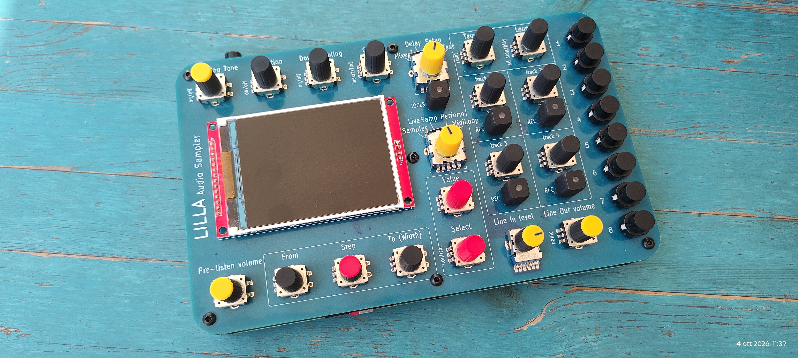

<p align="center">
	
</p>

# LILLA Audio Sampler 2026

This repository contains the firmware project for the LILLA Audio Sampler, a Teensy 4.1 based hardware sampler with up to 16 playback voices, designed and assembled in Italy.

The codebase targets a Teensy 4.1 running at 600 MHz and is organized as a standalone PlatformIO project with custom audio, display, storage, MIDI, and user-interface modules.

<p align="center">
    
</p>

Read the illustrated [User Guide](USER_GUIDE.md) for connections, controls and operating procedures.

## What This Project Does

LILLA is a polyphonic, multitimbral, multi-MIDI audio sampler designed to work with imported audio, self-recorded audio, and live input.

| Mode | Features |
| --- | --- |
| Performance | Up to 16 playback voices and 200 patches, each with up to eight sounds, individual MIDI channels and keyboard ranges. |
| Sampler | Mono/stereo recording into Flash, conversion into playable sounds and WAV export to microSD. |
| Live Sampler | Circular PSRAM recording with approximately 40 seconds in mono or 20 seconds in stereo, adjustable feedback and capture of selected regions into patches. |
| MIDI Loop | Four tracks of MIDI events, played through the current patch and stored on microSD. |

Sound shaping includes sample trimming, forward/reverse and loop playback, envelopes, instrument filters and modulation, a common low-pass filter, stereo delay, bit reduction and downsampling. Separate main and pre-listening routes support auditioning and performance.

## Live Sampler Recording

- A stereo-linked compressor processes the sum of line input and feedback before recording. Mixing uses 32-bit intermediate samples to preserve headroom before compression.
- A precalculated soft-knee curve starts reducing gain around -6 dBFS and limits sample peaks to approximately -1 dBFS once fully enabled.
- ON/OFF transitions take 10 ms. A 128-sample lookahead adds approximately 2.9 ms in both enabled and bypass states; the release time constant is approximately 100 ms.
- Select the yellow ON/OFF value beside **COMPRESSOR** and press **Select**, or use **S3** as a temporary shortcut. S3 currently replaces direct capture selection for slot 3. Compression starts off at power-on and retains its setting during the session.
- The compressor block processes audio only while Live Sampler is recording, including while visiting Mixer or Delay. Otherwise it releases incoming blocks without allocating output blocks.
- **FWD playback continues around the buffer while recording**, with both SYNC and FIXED start points. Held low notes no longer stop after one buffer length. Unrecorded regions remain protected during the first fill; after recording stops, normal one-shot FWD behavior resumes.

Compression cannot repair clipping already produced upstream; bypass and switching transitions do not guarantee peak protection. Live audio is temporary: capture useful regions into a patch and save them to Flash before switching off.

## Audio Files and Storage

- Internal audio format: signed 16-bit PCM at 44.1 kHz.
- Import from microSD: mono RAW, mono/stereo 16-bit PCM WAV and AIFF at 44.1 kHz, and MP3 with conversion to 44.1 kHz. See [MP3 import](docs/mp3-import.md) for supported rates and implementation details.
- Import duration limit: approximately 35.7 seconds per source file; longer files are truncated.
- Flash stores imported audio and Sampler recordings; PSRAM provides live recording and playback caches; FRAM stores patch and configuration data.
- Configuration and recording backup/restore are available through microSD. A complete archive also requires separate copies of the imported audio library and MIDI-loop files; see [Backup and restore](USER_GUIDE.md#backup-and-restore).

## Hardware Summary

The firmware is written for a hardware platform built around:

- Teensy 4.1
- Teensy Audio Adaptor Rev D
- 64 MB SPI Flash memory (SPI)
- 32 MB total PSRAM (Quad-SPI)
- 128KB FRAM (I2C)
- ILI9341 display

## Connections and Buttons

| Connection | Specification |
| --- | --- |
| Line in | 3.5 mm jack; stereo line / stereo dynamic microphone input. |
| Line out | 3.5 mm jack; stereo line output, 3.1 Vpp. |
| Phones line | 3.5 mm jack; main stereo headphone output. |
| Phones pre-listen | 3.5 mm jack; stereo pre-listening headphone output. |
| MIDI IN / OUT | 3.5 mm jacks. |
| Gate IN / OUT | 3.5 mm jacks, +5 V. |
| USB-C | +5 V DC power and programming. |
| microSD | Audio import/export, backups and MIDI-loop storage. |

Dedicated buttons provide firmware upload mode and power on/off.

MIDI OUT and Gate IN/OUT are physically available and accessible through classes included in the codebase, but no user-facing features currently use them. They are available for future development.

## Repository Layout

- [src](src): application entry point and firmware sources
- [include](include): global headers and shared declarations
- [lib](lib): custom modules for audio, display, control, storage, and routing
- [doc/assets/images](doc/assets/images): images used by the README and User Guide
- [tests](tests): host regression tests for audio, storage and navigation
- [docs](docs): technical notes and implementation details
- [USER_GUIDE.md](USER_GUIDE.md): illustrated operating guide
- [platformio.ini](platformio.ini): PlatformIO build configuration

## Build

Build the Teensy 4.1 firmware with PlatformIO:

```sh
pio run -e teensy41
```

The project targets Teensy 4.1 at 600 MHz. Building does not upload firmware to the instrument.

## Links

- [www.lillasampler.it](https://www.lillasampler.it/)
- [Facebook page](https://www.facebook.com/Lilla.audio.sampler)
- [Tindie product page](https://www.tindie.com/products/lillasampler/lilla-audio-sampler-2/)

## License

This repository includes a [LICENSE](LICENSE) file. See it for the applicable terms.