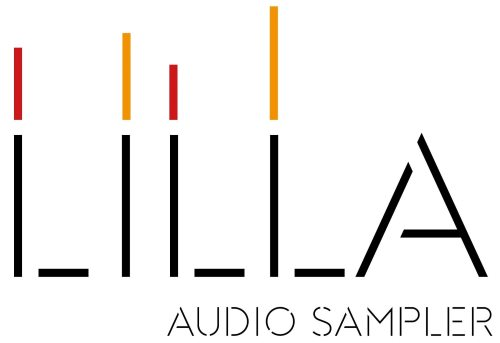

	

# LILLA Audio Sampler 2026

This repository contains the PlatformIO firmware project for the LILLA Audio Sampler, a Teensy 4.1 based hardware sampler designed and assembled in Italy.

The codebase targets a Teensy 4.1 running at 600 MHz and is organized as a standalone PlatformIO project with custom audio, display, storage, MIDI, and user-interface modules.

## What This Project Does

LILLA is a polyphonic, multitimbral, multi-MIDI audio sampler designed to work with imported audio, self-recorded audio, and live input.

Main operating modes:

- Performance mode with patches made of 1 to 8 sounds
- Sampler mode for recording and exporting audio to micro SD
- Live Sampler mode using PSRAM as temporary audio memory
- MIDI Loop mode for loop-based MIDI performance

## Hardware Summary

The firmware is written for a hardware platform built around:

- Teensy 4.1
- Teensy Audio Adaptor Rev D
- 64 MB SPI flash memory
- 16 MB total QSPI PSRAM
- 1-4 FRAM chips
- ILI9341 SPI display
- MCP23S17 shift-register based I/O expansion
- MIDI input and output
- stereo line input and output
- monitor output and phones output
- gate input and output
- micro SD storage

## Build Environment

This repository uses PlatformIO.

Current target from [platformio.ini](platformio.ini):

- platform: `teensy`
- board: `teensy41`
- framework: `arduino`
- CPU clock: `600000000L`
- build flag: `TEENSY_OPT_FASTEST`

Declared external library dependencies:

- Adafruit GFX Library
- Adafruit ILI9341
- Adafruit MCP23017 Arduino Library

## Repository Layout

- [src](src): application entry point and firmware sources
- [include](include): global headers and shared declarations
- [lib](lib): custom modules for audio, display, control, storage, and routing
- [doc/assets/images](doc/assets/images): README images copied for this repository
- [platformio.ini](platformio.ini): PlatformIO build configuration

## Project Notes

- Audio files are handled as 16-bit signed PCM at 44.1 kHz
- Sampler audio is stored in external flash memory
- Live Sampler audio is stored in PSRAM
- MIDI loops are stored on micro SD
- The codebase includes a large set of custom building blocks for playback, envelopes, filters, delays, display management, encoders, and archiving

## Project History

The images below were copied from the original LILLA project documentation and show the hardware evolution over time.

## Links

- [www.lillasampler.it](https://www.lillasampler.it/)
- [Facebook page](https://www.facebook.com/Lilla.audio.sampler)
- [Tindie product page](https://www.tindie.com/products/lillasampler/lilla-audio-sampler-2/)

## License

This repository includes a [LICENSE](LICENSE) file. See it for the applicable terms.